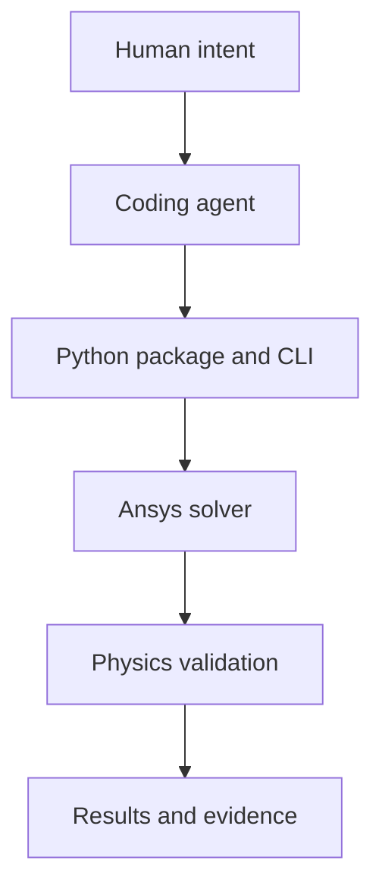

# Agentic Simulation Lab

Agent-first automation, reproducible simulation, and physics-validation workflows for Ansys® simulation software. The project organizes referential Mechanical, MAPDL, Fluent, AEDT, System Coupling, Rocky, and SPH interoperability behind one solver-independent catalog and CLI.

> This is an independent community project. It is not affiliated with, endorsed by, certified by, or supported by Ansys, Inc. It uses no Ansys logos or trade dress. Ansys software and an appropriate license must be obtained separately. Original repository-owned content is licensed under the Apache License 2.0; that repository license does not license Ansys software, documentation, examples, trademarks, or proprietary formats.

In this repository, *benchmark* means validation against an analytical solution, conservation law, dimensional relation, reload invariant, or documented physical trend. It does not mean competitive product analysis.

## Why agent-driven simulation?

Engineering automation is often trapped between GUI-only project state and one-off scripts. This lab makes the operating contract readable: a human or coding agent can discover a benchmark, understand its prerequisites, execute it through a stable CLI, and judge it with declared physics checks. The agent orchestrates the work; it never replaces the solver or physical validation.



Core principles are Local First and API-first operation, lazy optional integrations, project-relative and auditable state, physical evidence over exit codes, and honest preservation of failures and external blocks. The core runtime needs no online AI API, includes no telemetry, and never uploads models or results.

## Who is this for?

- Students can follow a staged path from environment diagnosis to mechanics, thermal, CFD, and advanced physics without installing every product at once.
- Simulation practitioners can turn repeatable Mechanical, Fluent, AEDT, Rocky, and coupled workflows into reviewable automation.
- Scientific-ML researchers can generate structured, provenance-rich datasets from validated benchmarks without conflating simulation with model training.

## What is here

- 11 physics domains with machine-readable manifests and historical evidence
- solver-backed scripts, physical acceptance checks, datasets, and reports
- a lazy Python package that does not import or launch proprietary solvers on import
- a CLI for discovery, diagnostics, dry runs, validation, audits, and reports
- explicit `PASS`, `FAIL`, `BLOCKED`, `PARTIAL`, and `NOT_RUN` semantics

Current counts and solver-label coverage are generated directly from the manifests in [PROJECT_METRICS.md](docs/PROJECT_METRICS.md).

Historical results describe specific local runs and remain separate from current `doctor` diagnostics; they are not guarantees for other versions, licenses, hardware, or meshes. Large generated artifacts are intentionally excluded from the public tree.

## Quick start

```bash
python -m pip install -e ".[dev]"
agentic-sim list
agentic-sim list --domain mechanics --status PASS
agentic-sim doctor
agentic-sim info cfd fluent-laminar-channel
agentic-sim run cfd --case fluent-laminar-channel --dry-run
agentic-sim report --json
agentic-sim validate
pytest
```

For a reproducible project-local environment, prefer `python tools/bootstrap.py --extras dev`. See the bilingual [project installation](docs/tutorials/install-project.md), [Windows installation](docs/tutorials/install-windows.md), and [macOS installation](docs/tutorials/install-macos.md) tutorials.

Install only the optional integration you need, such as `.[fluent]`, `.[mechanical]`, or `.[aedt]`. Solver execution additionally requires a compatible local Ansys installation and license; `doctor` never launches one unless a future adapter explicitly documents that behavior.

## Platform and prerequisites

| Platform | Core package and static workflows | Local Student solver execution |
|---|---|---|
| Windows 10/11 64-bit | Supported; Windows 11/Python 3.12 locally tested | Supported when a compatible official product and license are separately available |
| macOS | Supported for install, imports, CLI, catalog, dry-runs, tests, and audits | Not claimed; current Ansys Student desktop guidance is Windows-only |
| Linux | Core/static workflow is CI-configured | No Student desktop claim |

Python 3.10 or newer is required; the static CI matrix explicitly covers Python 3.10 and 3.12. Git is needed only to clone or contribute. Ansys products are optional for core use and must be obtained separately. See [tested environments](docs/TESTED_ENVIRONMENTS.md), [Student installation](docs/tutorials/install-ansys-student.md), and [AEDT Student installation](docs/tutorials/install-aedt-student.md).

## Layout

| Path | Purpose |
|---|---|
| `benchmarks/` | domain manifests, cases, common helpers, and small references |
| `src/agentic_simulation_lab/` | solver-independent core, CLI, and lazy adapters |
| `artifacts/` | ignored run products and migrated legacy outputs |
| `docs/` | architecture, tutorials, validation policy, and reports |
| `agent/` | agent operating contract and reusable skills |
| `tools/` | catalog and publication audits |

Start with [the architecture](docs/ARCHITECTURE.md), [validation policy](docs/VALIDATION.md), and [known limitations](docs/known-limitations.md). Chinese readers can use [README.zh-CN.md](README.zh-CN.md).

## Physics and solver coverage

The 11 domains are mechanics, thermal, CFD, multiphysics, materials, electromagnetics, acoustics, porous media/geomechanics, DEM, SPH, and phase-change/reactive flow. [SOLVER_MATRIX.md](docs/SOLVER_MATRIX.md) distinguishes available adapters from runtime product and license requirements; [PHYSICS_DOMAINS.md](docs/PHYSICS_DOMAINS.md) explains domain scope.

## Unified CLI and agent workflow

`doctor`, `list`, `info`, `run`, `validate`, `audit`, `report`, and `paths` are solver-independent commands. Their default output is concise for humans; `--json` provides stable structured output for agents and automation. Discovery and reporting work even when no PyAnsys integration is installed. A typical workflow is:

```text
understand physics → inspect manifest → diagnose → dry-run → execute
→ extract → validate → classify → preserve evidence
```

Read [AGENTS.md](AGENTS.md) and the vendor-neutral [agent workflow](agent/WORKFLOW.md) before delegating execution to a coding agent.
The [execution-security policy](docs/EXECUTION_SECURITY.md) defines subprocess, executable-trust, network, and environment boundaries.

## Validation and datasets

A zero exit code is never sufficient for PASS. Cases use analytical solutions, conservation, canonical comparisons, dimensional checks, or expected physical trends. Dataset workflows follow `validated benchmark → parameter sweep → solver/model → Dataset Contract v1 → safe reload validation`; large arrays remain under ignored artifacts. Scientific-AI users can inspect or validate a generated `dataset.json` with `agentic-sim dataset info|validate`, then load NPZ samples through `agentic_simulation_lab.datasets.open_dataset`. See [DATASETS.md](docs/DATASETS.md) and the bilingual [dataset tutorial](docs/tutorials/generate-a-dataset.md).

## Suggested learning path

Start with the curated [eight-case flagship learning path](docs/LEARNING_PATH.md): static cantilever → steady/transient thermal → laminar channel → CHT → acoustic tube → particle free fall, with a separate Fluent parametric dataset track. Each stop states the physics, automation lesson, validation basis, product/license requirement, rough cost, historical status, and exact dry-run/run commands. The [quickstart](docs/tutorials/quickstart.md) remains the short installation and CLI introduction.

## Project status

`benchmarks/catalog.json` is generated from domain manifests. Run `python tools/build_catalog.py` after manifest changes, then `python tools/build_catalog.py --check`. Case G premixed combustion remains a frozen validated failure. Case J preserves the historical 15.951% final-step `FAIL`; a fresh predeclared 10-step accounting window also failed at 15.842% against the unchanged 10% limit. The AEDT electrostatic catalog entry likewise preserves its historical `FAIL`, while fresh supported-path diagnosis stopped `BLOCKED` at version compatibility before session startup. Fresh diagnosis does not overwrite historical benchmark evidence, and neither failure is cosmetically upgraded.

The catalog also retains the historical Turek–Hron FSI failure and four product/API blocks. Details are in [known limitations](docs/known-limitations.md) and the [project showcase](docs/PROJECT_SHOWCASE.md).

## Contributing

Read [CONTRIBUTING.md](CONTRIBUTING.md), use project-relative paths, keep solver imports lazy, and attach physical evidence to status changes. General help follows [SUPPORT.md](SUPPORT.md); security reports follow [SECURITY.md](SECURITY.md). Do not publish proprietary solver files, license data, private paths, tokens, or personal information.

## Licensing and Ansys terms

Original repository-owned code, documentation, and fixtures are available under the [Apache License 2.0](LICENSE). Apache-2.0 does not license Ansys software or redistribute vendor content. Users remain responsible for their separately obtained Ansys license and current clickwrap. Student licenses are limited to educational use and exclude commercial use and competitive analysis. Read [Ansys usage and compliance](docs/ANSYS_USAGE_AND_COMPLIANCE.md), [Student product limits](docs/STUDENT_PRODUCT_LIMITS.md), the [official-source audit](docs/release/OFFICIAL_SOURCE_AUDIT.md), and the recorded [license decision](docs/release/LICENSE_DECISION.md).

Publication steps are documented in the bilingual [publishing tutorial](docs/tutorials/publishing.md) and truthful [release checklist](docs/release/RELEASE_CHECKLIST.md). The independent public repository was created from an audited clean export. The v0.1.0 tag and GitHub Release are separately gated finalization actions; PyPI and Zenodo are not part of this release.

## Disclaimer

Ansys software and licenses must be obtained separately and used under their applicable terms. Engineering results require independent review by qualified practitioners. See [DISCLAIMER.md](DISCLAIMER.md).

Ansys, Mechanical, Fluent, AEDT, Maxwell, HFSS, Rocky, System Coupling, SpaceClaim, and PyAnsys are trademarks or registered trademarks of Ansys, Inc. or its subsidiaries in the United States or other countries. All trademarks remain the property of their respective owners.
