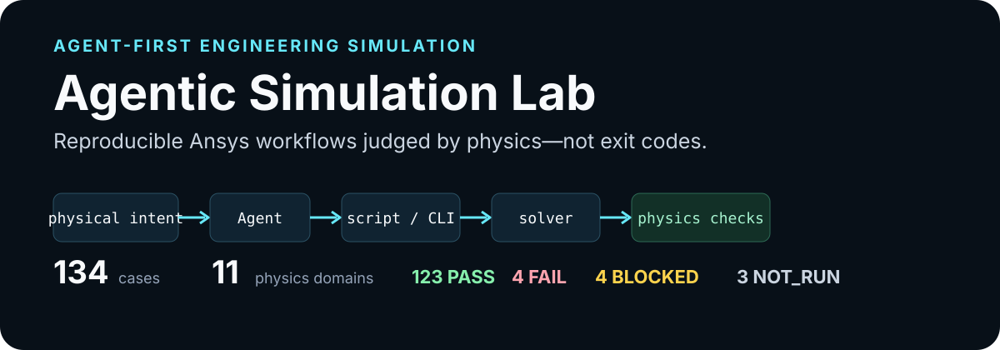
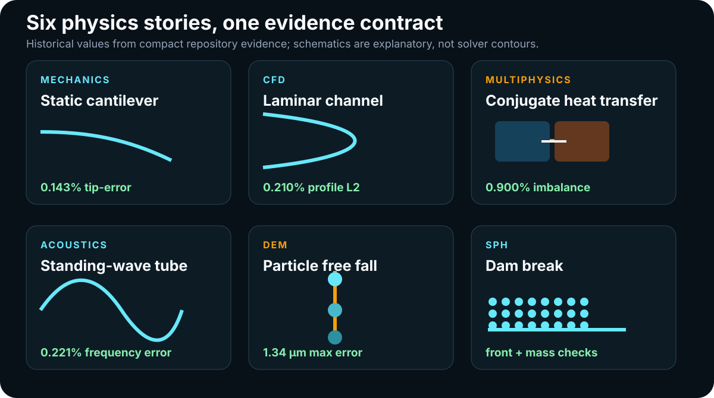
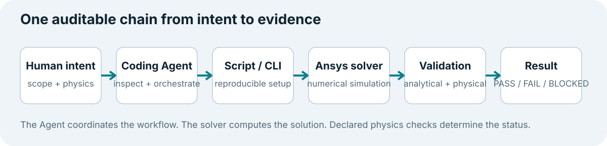

**English** | [简体中文](README.zh-CN.md)

# Agentic Simulation Lab



**Turn GUI-heavy engineering simulation into Agent-orchestrated, reproducible workflows with explicit physics validation and durable evidence.**

[Quick Start](#quick-start) · [Simulation Gallery](docs/BENCHMARKS.md) · [Documentation](docs/README.md) · [Learning Path](docs/LEARNING_PATH.md)

Agentic Simulation Lab makes this chain executable and auditable:

> **Human physical intent → Coding Agent → reproducible script / CLI → Ansys solver → physics validation → structured result**

The Agent discovers and coordinates the work. Ansys software still performs the numerical simulation. Declared physical checks—not a successful process exit—determine whether evidence is `PASS`, `FAIL`, `BLOCKED`, `PARTIAL`, or `NOT_RUN`.

## Real multi-domain simulation results

This repository contains real multi-domain simulation results. The PNG figures below are deterministic post-processing of qualified, solver-derived numeric evidence—not AI-generated contours or proprietary GUI screenshots.

| | |
|---|---|
| [](docs/assets/simulations/mechanics/static-cantilever.png) | [](docs/assets/simulations/cfd/fluent-cylinder-unsteady.png) |
| **Mechanics:** solved nodal displacement and stress | **CFD:** transient velocity and pressure fields |
| [](docs/assets/simulations/multiphysics/cht-fluent.png) | [](docs/assets/simulations/acoustics/acoustic-cavity-modal.png) |
| **Multiphysics:** fluid–solid conjugate heat transfer | **Acoustics:** solver eigenmode pressure slices |
| [](docs/assets/simulations/electromagnetics/magnetostatic.png) | [](docs/assets/simulations/dem/angle-of-repose.png) |
| **Electromagnetics:** reconstructed axisymmetric field | **DEM:** final solved particle configuration |
| [](docs/assets/simulations/sph/sph-dam-break.png) | [](docs/assets/simulations/phase_reactive/fluent-melting.png) |
| **SPH:** Lagrangian free-surface snapshots | **Phase change:** liquid-fraction evolution |

Browse all 11 representative figures in the [simulation-result provenance inventory](docs/SIMULATION_RESULTS.md) or continue to the [complete benchmark gallery](docs/BENCHMARKS.md). Explanatory SVGs remain as a separate orientation layer and are labeled as schematics or domain maps.

## See the lab before reading the architecture



These are historical repository results and validation schematics, not guarantees for another version, license, mesh, or machine. The schematics are not fabricated solver contours.

| Physics story | Solver / product | Validation basis | Historical evidence |
|---|---|---|---|
| [Static cantilever](benchmarks/mechanics/cases/smoke_static_cantilever.py) | Mechanical / MAPDL | Euler–Bernoulli tip deflection | **PASS** — 0.100143 mm vs 0.100000 mm; 0.143% error |
| [Laminar channel](benchmarks/cfd/cases/smoke_fluent_laminar_channel.py) | Fluent | Poiseuille profile, pressure drop, mass conservation | **PASS** — profile L2 error 0.210%; pressure-drop error 0.150% |
| [Conjugate heat transfer](benchmarks/multiphysics/cases/smoke_cht_fluent.py) | Fluent | Global energy closure and temperature bounds | **PASS** — 0.900% energy imbalance |
| [Acoustic tube](benchmarks/acoustics/cases/smoke_acoustic_tube.py) | MAPDL / Mechanical | Quarter-wave resonance | **PASS** — 86.0 Hz vs 85.81 Hz; 0.221% error |
| [Particle free fall](benchmarks/dem/cases/smoke_particle_freefall.py) | Rocky | Constant-gravity kinematics | **PASS** — maximum position error 1.34 µm |
| [SPH dam break](benchmarks/sph/cases/smoke_sph_dam_break.py) | Rocky | Front advance, mass conservation, time history, projection checks | **PASS** — all declared historical checks passed |

Browse the [complete visual catalog](docs/BENCHMARKS.md) for all **134 cases across 11 physics domains**, including the deliberately visible failures, external blocks, and cases without attributable run evidence.

## What problem does it solve?

Traditional simulation work often leaves important state inside GUI clicks, local project files, and one-off scripts. That makes a workflow hard to reproduce, review, delegate to a coding Agent, or reuse for dataset generation. This project gives each case a stable manifest, CLI entry point, solver-local implementation, declared validation logic, structured result contract, and compact evidence record.

It is a laboratory for learning and building trustworthy automation—not a replacement for Ansys products, licenses, qualified engineering review, or numerical judgment.

## How it works



1. `list` and `info` read solver-independent manifests without importing a proprietary integration.
2. `doctor` diagnoses the current machine without launching a solver by default.
3. `run ... --dry-run` resolves the exact command, prerequisites, paths, timeout, and expected result.
4. An explicitly authorized run calls the local solver through a supported API or script interface.
5. The case extracts numerical evidence and applies predeclared analytical, conservation, canonical, dimensional, or physical-trend checks.
6. `run.json` records process and physics status separately; the manifest's result file remains authoritative.

Read the [architecture](docs/ARCHITECTURE.md), [validation policy](docs/VALIDATION.md), and [Agent operating workflow](agent/WORKFLOW.md) when you need the full contract.

## Quick Start

The core catalog, CLI, dry-runs, tests, and audits do not require Ansys software.

```bash
python -m pip install -e ".[dev]"
agentic-sim list
agentic-sim doctor
agentic-sim info cfd fluent-laminar-channel
agentic-sim run cfd --case fluent-laminar-channel --dry-run
agentic-sim validate
```

For a reproducible project-local environment, use `python tools/bootstrap.py --extras dev`. Install only the solver extra you need, such as `.[mechanical]`, `.[fluent]`, `.[aedt]`, or `.[rocky]`.

Removing `--dry-run` is a separate decision: it requires explicit authorization, a compatible official local product, and an available license. Start with the bilingual [Quick Start](docs/tutorials/quickstart.md), then follow [Run a benchmark](docs/tutorials/run-a-benchmark.md).

## Explore the lab

| If you are… | Start here | What you will find |
|---|---|---|
| an engineering or science student | [Flagship learning path](docs/LEARNING_PATH.md) | Eight staged cases from beam bending to CFD, CHT, acoustics, particles, and datasets |
| a Mechanical / Fluent / AEDT / Rocky user | [Simulation catalog](docs/BENCHMARKS.md) and [solver matrix](docs/SOLVER_MATRIX.md) | Reproducible case scripts, product requirements, validation basis, and honest historical status |
| a Scientific-AI researcher | [Dataset guide](docs/DATASETS.md) and [dataset tutorial](docs/tutorials/generate-a-dataset.md) | Parameter sweeps, portable Dataset Contract v1 metadata, safe NPZ loading, checksums, and separate physics provenance |
| a contributor or tool builder | [Development guide](docs/DEVELOPMENT.md) and [contributing](CONTRIBUTING.md) | Manifest schema, result contracts, lazy integrations, static validation, and publication boundaries |

The [documentation home](docs/README.md) separates newcomer tutorials from concepts, reference, compliance, reports, and maintainer-only release evidence. It also defines the project's maintainable bilingual policy.

## Technical principles

- **Local First** — no telemetry, automatic upload, or online AI API in the core runtime; solver work runs locally after dependencies are installed.
- **API / Script First** — supported CLIs, Python APIs, and solver scripting interfaces are the default, not fragile GUI automation.
- **Agent / Model Agnostic** — any coding Agent that follows the repository contract can inspect and orchestrate the same workflow.
- **Physics First** — an exit code cannot establish correctness; declared physical evidence must support `PASS`.
- **Reproducible and auditable** — project-relative manifests, routed artifacts, bounded subprocesses, explicit provenance, and stable result contracts.
- **Honest evidence semantics** — known `FAIL`, `BLOCKED`, and `NOT_RUN` cases remain visible because negative evidence is part of scientific credibility.

Current generated counts are in [project metrics](docs/PROJECT_METRICS.md). Known failures and product/API limitations—including the AEDT electrostatic regression, Turek–Hron FSI, reactive-flow energy accounting, Rocky two-way coupling, and selected SPH modes—are documented in [known limitations](docs/known-limitations.md).

## Platform and solver requirements

Python 3.10 or newer is required. The solver-free core and static workflows support Windows, macOS, and CI-configured Linux; local Ansys Student desktop execution is currently documented for compatible Windows installations. Product availability, license terms, model limits, integration versions, and supported transports vary.

See [tested environments](docs/TESTED_ENVIRONMENTS.md), [solver support matrix](docs/SOLVER_MATRIX.md), [Student product limits](docs/STUDENT_PRODUCT_LIMITS.md), and the platform installation tutorials under [`docs/tutorials/`](docs/tutorials/).

## Contributing

Contributions are welcome when they preserve project-relative paths, lazy solver imports, physical acceptance criteria, evidence status, and public-tree privacy. Read [CONTRIBUTING.md](CONTRIBUTING.md), use [SUPPORT.md](SUPPORT.md) for help, and report security issues through [SECURITY.md](SECURITY.md).

After manifest or gallery changes, regenerate and check the public navigation:

```bash
python tools/build_catalog.py
python tools/build_project_metrics.py
python tools/build_gallery.py
python tools/build_gallery.py --check
python tools/build_simulation_visuals.py --check
python tools/check_links.py
```

## License, compliance, and disclaimer

This is an independent community project. It is not affiliated with, endorsed by, certified by, or supported by Ansys, Inc. Ansys software and an appropriate license must be obtained separately and used under their applicable terms. The repository does not distribute Ansys software, proprietary solver databases, vendor documentation, logos, or trade dress.

Original repository-owned code, documentation, and fixtures are licensed under the [Apache License 2.0](LICENSE). That license does not license Ansys software, documentation, examples, trademarks, or proprietary formats. Student licenses are limited to educational use and exclude commercial use and competitive analysis. Engineering results require independent review by qualified practitioners.

Read [Ansys usage and compliance](docs/ANSYS_USAGE_AND_COMPLIANCE.md), the full [disclaimer](DISCLAIMER.md), and [third-party notices](THIRD_PARTY_NOTICES.md).

Ansys, Mechanical, Fluent, AEDT, Maxwell, HFSS, Rocky, System Coupling, SpaceClaim, and PyAnsys are trademarks or registered trademarks of Ansys, Inc. or its subsidiaries in the United States or other countries. All trademarks remain the property of their respective owners.
