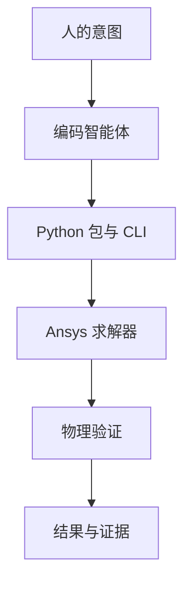

# Agentic Simulation Lab

这是一个面向 Ansys® 仿真软件的智能体优先自动化、可复现仿真与物理验证项目。项目把对 Mechanical、MAPDL、Fluent、AEDT、System Coupling、Rocky 与 SPH 的指称性互操作统一到不依赖求解器导入的目录索引和命令行界面中。

> 本项目是独立社区项目，与 Ansys, Inc. 不存在隶属、背书、认证或官方支持关系，不使用 Ansys 标志或商业外观。Ansys 软件及适用于预期用途的许可证必须另行取得。仓库原创内容采用 Apache License 2.0；该仓库许可证不许可 Ansys 软件、文档、示例、商标或专有格式。

本仓库中的“基准”是指对解析解、守恒定律、量纲关系、重载不变量或有依据物理趋势的验证，不是商业产品竞争分析。

## 为什么采用智能体驱动的仿真方式？

工程自动化常被困在 GUI 工程状态和一次性脚本之间。本项目把操作契约写清楚：人或编码智能体都能发现基准、理解前置条件、通过稳定 CLI 执行，并使用明确的物理检查判断结果。智能体负责协调，不替代求解器，也不替代物理验证。



建议用 `python tools/bootstrap.py --extras dev` 创建可复现的项目本地环境。详见双语[项目安装](docs/tutorials/install-project.zh-CN.md)、[Windows 安装](docs/tutorials/install-windows.zh-CN.md)与 [macOS 安装](docs/tutorials/install-macos.zh-CN.md)教程。

项目坚持 Local First 与 API 优先、可选集成延迟加载、状态可审计、物理证据优先于退出码，并如实保留失败和外部阻塞。核心运行时不需要在线 AI API，不含遥测，也不会上传模型或结果。

## 适合哪些用户？

- 理工科学生可以从环境诊断逐步学习力学、热学、CFD 与高级物理，无需一次安装所有产品。
- 传统仿真用户可以把 Mechanical、Fluent、AEDT、Rocky 和耦合流程变成可审阅的自动化。
- 科学机器学习研究者可以从已验证基准生成带来源信息的结构化数据，而不把仿真生成与模型训练混为一谈。

## 项目内容

- 11 个物理领域，每个领域都有机器可读清单和历史证据；
- 真实求解脚本、物理验收条件、数据集和报告；
- 延迟加载的 Python 包：导入包时不会导入或启动商业求解器；
- 用于发现、诊断、试运行、验证、审计和统计的统一 CLI；
- 明确区分 `PASS`、`FAIL`、`BLOCKED`、`PARTIAL` 与 `NOT_RUN`。

当前数量和求解器标签覆盖由 manifests 直接生成到 [PROJECT_METRICS.md](docs/PROJECT_METRICS.md)。历史运行结果与当前 `doctor` 环境诊断保持语义分离。

历史结果只代表特定版本、许可证、硬件与网格下的本地运行，不构成对其他环境的保证。大型生成物不会进入公开源码树。

## 快速开始

```bash
python -m pip install -e ".[dev]"
agentic-sim list
agentic-sim doctor
agentic-sim info cfd fluent-laminar-channel
agentic-sim run cfd --case fluent-laminar-channel --dry-run
agentic-sim validate
pytest
```

请按需安装可选依赖，例如 `.[fluent]`、`.[mechanical]` 或 `.[aedt]`。真正运行案例还需要兼容的本地 Ansys 安装与许可证。`doctor` 默认只做静态环境检查，不会启动求解器。

## 平台与前置条件

| 平台 | 核心包与静态流程 | 本地 Student 求解器执行 |
|---|---|---|
| Windows 10/11 64 位 | 支持；已在 Windows 11/Python 3.12 本地测试 | 另行具备兼容官方产品和许可证时支持 |
| macOS | 支持安装、导入、CLI、目录、试运行、测试和审计 | 不作支持声明；当前 Ansys Student 桌面产品指导面向 Windows |
| Linux | 核心/静态流程已配置 CI | 不声明 Student 桌面支持 |

需要 Python 3.10 或更高版本；静态 CI matrix 明确覆盖 Python 3.10 与 3.12。只有克隆或贡献时才需要 Git。核心功能不要求 Ansys；产品必须另行取得。参见[测试环境](docs/TESTED_ENVIRONMENTS.md)、[Ansys Student 安装](docs/tutorials/install-ansys-student.zh-CN.md)和 [AEDT Student 安装](docs/tutorials/install-aedt-student.zh-CN.md)。

## 目录结构

| 路径 | 作用 |
|---|---|
| `benchmarks/` | 领域清单、案例、公共辅助代码与小型参考结果 |
| `src/agentic_simulation_lab/` | 求解器无关核心、CLI 与延迟加载适配器 |
| `artifacts/` | 被忽略的运行产物和迁移后的历史输出 |
| `docs/` | 架构、教程、验证规范与报告 |
| `agent/` | 智能体工作约定与可复用技能 |
| `tools/` | 目录生成和公开发布审计工具 |

建议先阅读[架构说明](docs/ARCHITECTURE.md)、[验证规范](docs/VALIDATION.md)和[已知限制](docs/known-limitations.md)。

## 物理领域与求解器覆盖

11 个领域分别为力学、热学、CFD、多物理场、材料、电磁、声学、多孔介质/岩土、DEM、SPH 和相变/反应流。[SOLVER_MATRIX.md](docs/SOLVER_MATRIX.md) 区分“已有适配器”和“运行时产品/许可证要求”；[PHYSICS_DOMAINS.md](docs/PHYSICS_DOMAINS.md) 说明各领域范围。

## 统一 CLI 与智能体工作流

`doctor`、`list`、`info`、`run`、`validate`、`audit`、`report` 和 `paths` 都由求解器无关核心提供。即使没有安装任何 PyAnsys 集成，也能完成发现和报告。标准流程是：

```text
理解物理 → 查看清单 → 诊断 → 试运行 → 执行
→ 提取 → 验证 → 分类 → 保存证据
```

把执行任务交给编码智能体前，请先阅读 [AGENTS.md](AGENTS.md) 与不绑定特定厂商智能体的[工作流](agent/WORKFLOW.md)。
[执行安全策略](docs/EXECUTION_SECURITY.md)规定子进程、可执行文件信任、网络与环境边界。

## 验证与数据集

进程返回零绝不等于物理通过。案例使用解析解、守恒、经典基准、量纲检查或预期物理趋势。数据集遵循“已验证基准 → 参数扫描 → 求解器/模型 → Dataset Contract v1 → 安全重载验证”；大型数组保留在被忽略的 artifacts 中。Scientific-AI 用户可以用 `agentic-sim dataset info|validate` 检查生成的 `dataset.json`，再通过 `agentic_simulation_lab.datasets.open_dataset` 加载 NPZ 样本。详见 [DATASETS.md](docs/DATASETS.md) 与双语[数据集教程](docs/tutorials/generate-a-dataset.zh-CN.md)。

## 建议学习路径

从精选的[八案例旗舰学习路径](docs/LEARNING_PATH.zh-CN.md)开始：静力悬臂梁 → 稳态/瞬态热学 → 层流通道 → CHT → 声管 → 粒子自由落体，并包含独立的 Fluent 参数化数据集轨道。每一站都说明物理、自动化教学点、验证依据、产品/许可证要求、粗略成本、历史状态和完整 dry-run/run 命令。[快速开始](docs/tutorials/quickstart.zh-CN.md)继续承担简短安装与 CLI 入门。

## 当前状态

`benchmarks/catalog.json` 由各领域清单生成。修改清单后运行 `python tools/build_catalog.py`，再用 `--check` 校验。预混燃烧 Case G 保持冻结的有证据失败。Case J 保留历史 final-step 15.951% 的 `FAIL`；fresh 预声明 10-step 核算窗口同样以 15.842% 超过未改变的 10% 上限。AEDT 静电目录项也保留 historical `FAIL`，而 fresh supported-path 诊断在 session startup 之前停在版本兼容性 `BLOCKED`。Fresh 诊断不会覆盖历史 benchmark 证据，项目也不会为了展示效果把失败改写成通过。

目录还保留了 Turek–Hron FSI 的历史失败和 4 个产品/API 阻塞。详情见[已知限制](docs/known-limitations.md)与[项目展示](docs/PROJECT_SHOWCASE.md)。

## 参与贡献与免责声明

贡献前请阅读 [CONTRIBUTING.md](CONTRIBUTING.md)，保持路径可移植、求解器导入延迟，并为状态变化附上物理证据。一般支持见 [SUPPORT.md](SUPPORT.md)，安全问题见 [SECURITY.md](SECURITY.md)。不要公开专有求解器文件、许可证数据、私人路径、令牌或个人信息。

仓库原创代码、文档与 fixtures 采用 [Apache License 2.0](LICENSE)。Apache-2.0 不许可 Ansys 软件，也不分发厂商内容。用户必须另行取得 Ansys 许可证并遵守当前 clickwrap；Student 许可证限教育用途，排除商业用途与竞争分析。详见 [Ansys 使用与合规](docs/ANSYS_USAGE_AND_COMPLIANCE.md)、[Student 产品限制](docs/STUDENT_PRODUCT_LIMITS.md)、[官方来源审计](docs/release/OFFICIAL_SOURCE_AUDIT.md)和[许可证决策](docs/release/LICENSE_DECISION.md)。

发布步骤见双语[发布教程](docs/tutorials/publishing.zh-CN.md)与真实状态的[发布检查清单](docs/release/RELEASE_CHECKLIST.md)。独立 public repository 已由通过审计的 clean export 创建；v0.1.0 tag 与 GitHub Release 是单独设 Gate 的最终发布动作，PyPI 和 Zenodo 不属于本次发布。工程结果仍必须由合格专业人员独立复核，完整声明见 [DISCLAIMER.md](DISCLAIMER.md)。

Ansys、Mechanical、Fluent、AEDT、Maxwell、HFSS、Rocky、System Coupling、SpaceClaim 与 PyAnsys 是 Ansys, Inc. 或其子公司在美国或其他国家/地区的商标或注册商标。其他商标归各自权利人所有。
