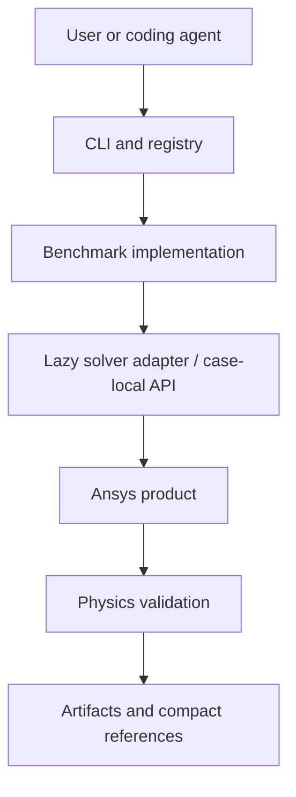

# Architecture

The CLI and registry are standard-library code. They read 11 domain manifests without importing a solver package. Manifests own identity, solver, analysis, entrypoint, expected artifacts, status, and evidence, so discovery never guesses from filenames.

Benchmark implementations retain the domain-specific geometry, solver setup, extraction, and validation logic. Shared code stays in each domain's `common/` layer. Lazy adapters provide a narrow integration seam; vendor packages are imported only inside an adapter function or executed case.

Each real run uses a subprocess and receives routed output/log directories. Simulation files flow to `artifacts/runs/<domain>/<case>/<timestamp>/`, datasets to `artifacts/datasets/`, and logs to `artifacts/logs/`. Only compact, sanitized, checksum-backed evidence belongs in `benchmarks/*/references/`.

A status is evidence, not decoration. Manifest schema v2 makes the authoritative result path explicit for executable cases. Canonical Case Result Contract v1 defaults to `case-result.json` under the routed output directory and contains `schema_version`, `status`, `checks`, `metrics`, `artifacts`, and `provenance`. A migrated case may temporarily declare one exact legacy result path and `result_format: legacy`; this is a compatibility adapter, not a second source of truth. Supporting JSON is never scanned for status. Schema v1 manifests remain readable for compatibility.

The executor writes `run.json` with separate process and physics status, the effective timeout, and the authoritative result path. A zero process exit without a valid authoritative result is `FAIL`, while dry-run remains `NOT_RUN`. Case metadata supplies a safe timeout (900 seconds by default), and `run --timeout SECONDS` can override it explicitly.

The solver-independent `agentic_simulation_lab.datasets` module adds Dataset Contract v1 without changing the execution architecture. Opening `dataset.json` is standard-library-only; NumPy is imported lazily for sample loading and deep validation. Dataset descriptors remain independent from `case-result.json`: the former describes portable samples and provenance, while the latter classifies one generator process and its physics checks.
