# Simulation and benchmark catalog

**English** | [简体中文](BENCHMARKS.zh-CN.md)

<!-- Generated by tools/build_gallery.py from manifests, case source, and compact reference evidence. Do not edit generated tables manually. -->

This is the complete human-facing index of all **134** public catalog entries across **11** physics domains. Manifest-declared historical status counts are `PASS` 123, `FAIL` 4, `BLOCKED` 4, and `NOT_RUN` 3. They do not guarantee the same outcome on another installation, version, license, mesh, or machine.

Each domain keeps an SVG portfolio/status overview that is **not a simulation contour**, followed by one deterministic PNG reconstructed from compact solver output. Cases without true result figures are not padded with decorative visual placeholders. See [real simulation results and provenance](SIMULATION_RESULTS.md) for the complete source inventory.

Read the [status and validation policy](VALIDATION.md) and the [Quick Start](tutorials/quickstart.md). Always inspect with `info`, diagnose with `doctor`, and use `--dry-run` before an authorized solver execution.

## Acoustics

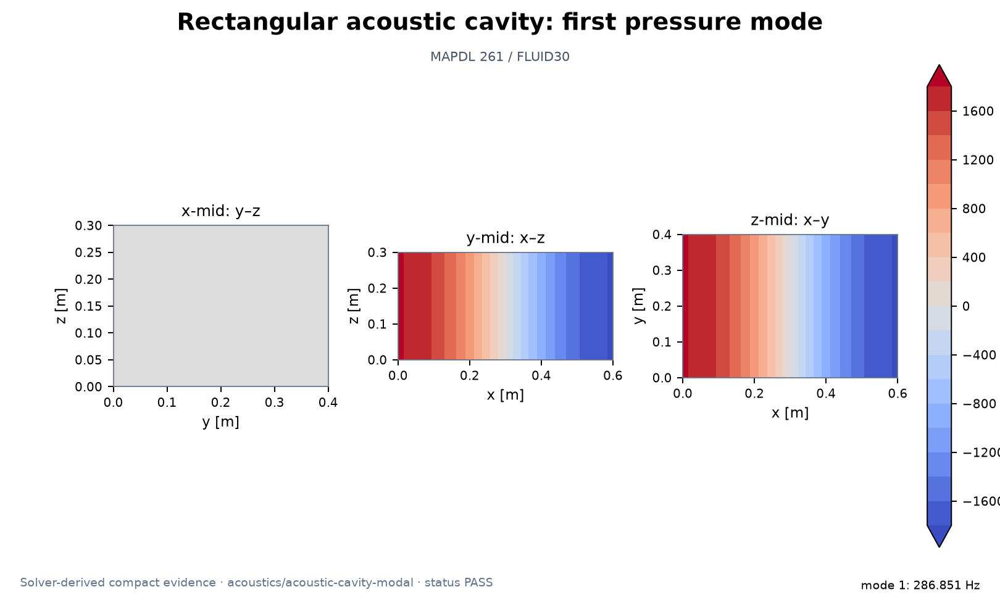

Representative result: [`acoustics/acoustic-cavity-modal`](../benchmarks/acoustics/cases/smoke_acoustic_cavity_modal.py) · [sanitized numeric evidence](assets/simulations/acoustics/acoustic-cavity-modal.evidence.json) · [provenance notes](SIMULATION_RESULTS.md)

| Case and physical problem | Solver / role | Status | Validation basis / representative result | Code, evidence, and visual |
|---|---|---|---|---|
| [`acoustics/acoustic-cavity-modal`](../benchmarks/acoustics/cases/smoke_acoustic_cavity_modal.py) — closed rectangular acoustic cavity modal benchmark | MAPDL/Mechanical benchmark | **PASS** | mode count; mode field saved; maximum frequency error below 4pct | [code](../benchmarks/acoustics/cases/smoke_acoustic_cavity_modal.py) · [evidence](../benchmarks/acoustics/references/suite_summary.json) · [solver-result PNG](assets/simulations/acoustics/acoustic-cavity-modal.png) |
| [`acoustics/acoustic-dataset`](../benchmarks/acoustics/cases/smoke_acoustic_dataset.py) — 12 actually solved parametric standing-wave fields for surrogate use | Python validator/generator dataset | **PASS** | Compact historical evidence is linked; no case-specific metric is duplicated here | [code](../benchmarks/acoustics/cases/smoke_acoustic_dataset.py) · [evidence](../benchmarks/acoustics/references/suite_summary.json) |
| [`acoustics/acoustic-impedance`](../benchmarks/acoustics/cases/smoke_acoustic_impedance.py) — rigid versus impedance-terminated acoustic tube | MAPDL/Mechanical benchmark | **PASS** | both sweeps complete; rigid reflection near unity; matched reflection below 0p15 | [code](../benchmarks/acoustics/cases/smoke_acoustic_impedance.py) · [evidence](../benchmarks/acoustics/references/suite_summary.json) |
| [`acoustics/acoustic-pml`](../benchmarks/acoustics/cases/smoke_acoustic_pml.py) — Focused Phase-0 probe of harmonic FLUID30 perfectly matched layers | MAPDL/Mechanical benchmark | **PASS** | finite nonzero solution; attenuation inside pml; pml end strongly attenuated | [code](../benchmarks/acoustics/cases/smoke_acoustic_pml.py) · [evidence](../benchmarks/acoustics/references/suite_summary.json) |
| [`acoustics/acoustic-radiation`](../benchmarks/acoustics/cases/smoke_acoustic_radiation.py) — 3-D point source with rigid and MAPDL INF radiation boundaries | MAPDL/Mechanical benchmark | **PASS** | two boundary models solved; radiation decay error below 25pct; radiation pr consistent | [code](../benchmarks/acoustics/cases/smoke_acoustic_radiation.py) · [evidence](../benchmarks/acoustics/references/suite_summary.json) |
| [`acoustics/acoustic-structural-coupling`](../benchmarks/acoustics/cases/smoke_acoustic_structural_coupling.py) — strong two-way matrix-coupled flexible plate and acoustic cavity modes | MAPDL/Mechanical benchmark | **PASS** | three models solved; coupled field saved; acoustic pressure in coupled mode | [code](../benchmarks/acoustics/cases/smoke_acoustic_structural_coupling.py) · [evidence](../benchmarks/acoustics/references/suite_summary.json) |
| [`acoustics/acoustic-transient`](../benchmarks/acoustics/cases/smoke_acoustic_transient.py) — transient pressure pulse propagation in a straight acoustic domain | MAPDL/Mechanical benchmark | **PASS** | history complete; snapshots saved; causal probe order | [code](../benchmarks/acoustics/cases/smoke_acoustic_transient.py) · [evidence](../benchmarks/acoustics/references/suite_summary.json) |
| [`acoustics/acoustic-tube`](../benchmarks/acoustics/cases/smoke_acoustic_tube.py) — MAPDL FLUID30 pressure-driven open/closed standing-wave tube | MAPDL/Mechanical benchmark | **PASS** | Quarter-wave resonance; 86.0 Hz vs 85.81 Hz (0.221% error) | [code](../benchmarks/acoustics/cases/smoke_acoustic_tube.py) · [evidence](../benchmarks/acoustics/references/suite_summary.json) · [explanatory schematic](assets/showcase/acoustic-tube.svg) |
| [`acoustics/helmholtz-resonator`](../benchmarks/acoustics/cases/smoke_helmholtz_resonator.py) — cavity-plus-neck Helmholtz resonator harmonic sweep | MAPDL/Mechanical benchmark | **PASS** | frequency sweep complete; resonance error below 15pct; neck velocity nonzero | [code](../benchmarks/acoustics/cases/smoke_helmholtz_resonator.py) · [evidence](../benchmarks/acoustics/references/suite_summary.json) |
| [`acoustics/vibroacoustic-radiation`](../benchmarks/acoustics/cases/smoke_vibroacoustic_radiation.py) — solved shell vibration driving a one-way acoustic radiation model | MAPDL/Mechanical benchmark | **PASS** | structural response nonzero; velocity transferred; acoustic response nonzero | [code](../benchmarks/acoustics/cases/smoke_vibroacoustic_radiation.py) · [evidence](../benchmarks/acoustics/references/suite_summary.json) |
| [`acoustics/acoustics-dataset`](../benchmarks/acoustics/cases/validate_acoustics_dataset.py) — Independent validation for the acoustic NPZ dataset and transient evidence | Python validator/generator utility | **PASS** | case count 10 to 20; coordinates shape; connectivity shape | [code](../benchmarks/acoustics/cases/validate_acoustics_dataset.py) · [evidence](../benchmarks/acoustics/references/suite_summary.json) |

## Computational fluid dynamics

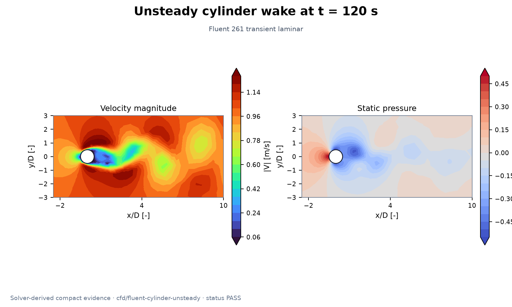

Representative result: [`cfd/fluent-cylinder-unsteady`](../benchmarks/cfd/cases/smoke_fluent_cylinder_unsteady.py) · [sanitized numeric evidence](assets/simulations/cfd/fluent-cylinder-unsteady.evidence.json) · [provenance notes](SIMULATION_RESULTS.md)

| Case and physical problem | Solver / role | Status | Validation basis / representative result | Code, evidence, and visual |
|---|---|---|---|---|
| [`cfd/fluent-acoustics`](../benchmarks/cfd/cases/smoke_fluent_acoustics.py) — FW-H setup plus pressure-fluctuation spectrum from Case H | Fluent benchmark | **PASS** | fwh model configured; cylinder source zone configured; observer defined | [code](../benchmarks/cfd/cases/smoke_fluent_acoustics.py) · [evidence](../benchmarks/cfd/references/historical_results.json) |
| [`cfd/fluent-airfoil`](../benchmarks/cfd/cases/smoke_fluent_airfoil.py) — automated NACA 0012 angle-of-attack sweep | Fluent benchmark | **PASS** | all fields valid; lift monotonic; zero aoa lift near zero | [code](../benchmarks/cfd/cases/smoke_fluent_airfoil.py) · [evidence](../benchmarks/cfd/references/historical_results.json) |
| [`cfd/fluent-backward-step`](../benchmarks/cfd/cases/smoke_fluent_backward_step.py) — steady laminar backward-facing-step separation benchmark | Fluent benchmark | **PASS** | reattachment detected; reattachment in benchmark range; mass error lt 2pct | [code](../benchmarks/cfd/cases/smoke_fluent_backward_step.py) · [evidence](../benchmarks/cfd/references/historical_results.json) |
| [`cfd/fluent-cavity`](../benchmarks/cfd/cases/smoke_fluent_cavity.py) — steady 2-D lid-driven cavity at Re=100 and 1000 | Fluent benchmark | **PASS** | Compact historical evidence is linked; no case-specific metric is duplicated here | [code](../benchmarks/cfd/cases/smoke_fluent_cavity.py) · [evidence](../benchmarks/cfd/references/historical_results.json) |
| [`cfd/fluent-compressible-nozzle`](../benchmarks/cfd/cases/smoke_fluent_compressible_nozzle.py) — 2-D compressible converging-diverging nozzle | Fluent benchmark | **PASS** | throat choked; exit supersonic; exit mach error lt 25pct | [code](../benchmarks/cfd/cases/smoke_fluent_compressible_nozzle.py) · [evidence](../benchmarks/cfd/references/historical_results.json) |
| [`cfd/fluent-connect`](../benchmarks/cfd/cases/smoke_fluent_connect.py) — minimal PyFluent -> Fluent 261 automation-chain smoke test | Fluent benchmark | **PASS** | pyfluent import; executable found; version 261 | [code](../benchmarks/cfd/cases/smoke_fluent_connect.py) · [evidence](../benchmarks/cfd/references/suite_summary.json) |
| [`cfd/fluent-cylinder`](../benchmarks/cfd/cases/smoke_fluent_cylinder.py) — steady 2-D laminar flow around a circular cylinder at Re=40 | Fluent benchmark | **PASS** | re equals 40; classic cd range; lift near zero | [code](../benchmarks/cfd/cases/smoke_fluent_cylinder.py) · [evidence](../benchmarks/cfd/references/historical_results.json) |
| [`cfd/fluent-cylinder-unsteady`](../benchmarks/cfd/cases/smoke_fluent_cylinder_unsteady.py) — unsteady Re=100 circular-cylinder vortex shedding | Fluent benchmark | **PASS** | strouhal in classic range; mean cd in classic range; periodic lift nonzero | [code](../benchmarks/cfd/cases/smoke_fluent_cylinder_unsteady.py) · [evidence](../benchmarks/cfd/references/historical_results.json) · [solver-result PNG](assets/simulations/cfd/fluent-cylinder-unsteady.png) |
| [`cfd/fluent-laminar-channel`](../benchmarks/cfd/cases/smoke_fluent_laminar_channel.py) — 2-D fully developed laminar parallel-plate channel | Fluent benchmark | **PASS** | Poiseuille profile, pressure drop, and mass conservation; profile L2 error 0.210% | [code](../benchmarks/cfd/cases/smoke_fluent_laminar_channel.py) · [evidence](../benchmarks/cfd/references/historical_results.json) · [explanatory schematic](assets/showcase/laminar-channel.svg) |
| [`cfd/fluent-les-des`](../benchmarks/cfd/cases/smoke_fluent_les_des.py) — low-cost 3-D transient WALE LES cylinder automation smoke test | Fluent benchmark | **PASS** | les model ran; nonzero unsteady lift; dominant frequency reasonable | [code](../benchmarks/cfd/cases/smoke_fluent_les_des.py) · [evidence](../benchmarks/cfd/references/historical_results.json) |
| [`cfd/fluent-mesh-sensitivity`](../benchmarks/cfd/cases/smoke_fluent_mesh_sensitivity.py) — coarse/medium/fine mesh sensitivity for backward-facing step | Fluent benchmark | **PASS** | cell counts increase; all reattachment detected; medium fine change lt 8pct | [code](../benchmarks/cfd/cases/smoke_fluent_mesh_sensitivity.py) · [evidence](../benchmarks/cfd/references/historical_results.json) |
| [`cfd/fluent-natural-convection`](../benchmarks/cfd/cases/smoke_fluent_natural_convection.py) — differentially heated square-cavity natural convection | Fluent benchmark | **PASS** | rayleigh in benchmark range; temperature bounded; flow developed | [code](../benchmarks/cfd/cases/smoke_fluent_natural_convection.py) · [evidence](../benchmarks/cfd/references/historical_results.json) |
| [`cfd/fluent-optimization-parallel`](../benchmarks/cfd/cases/smoke_fluent_optimization_parallel.py) — nine-point aerodynamic search and 1/2/4-core Fluent comparison | Fluent benchmark | **PASS** | optimization has 9 cases; five new fluent runs; best objective positive | [code](../benchmarks/cfd/cases/smoke_fluent_optimization_parallel.py) · [evidence](../benchmarks/cfd/references/historical_results.json) |
| [`cfd/fluent-parametric-dataset`](../benchmarks/cfd/cases/smoke_fluent_parametric_dataset.py) — 12-case Fluent-to-NPZ educational Dataset Contract v1 workflow | Python validator/generator dataset | **PASS** | Compact historical evidence is linked; no case-specific metric is duplicated here | [code](../benchmarks/cfd/cases/smoke_fluent_parametric_dataset.py) · [evidence](../benchmarks/cfd/references/historical_results.json) |
| [`cfd/fluent-rans-models`](../benchmarks/cfd/cases/smoke_fluent_rans_models.py) — realizable k-epsilon vs k-omega SST on a turbulent backward step | Fluent benchmark | **PASS** | both reattachment detected; reattachment in broad range; yplus exported | [code](../benchmarks/cfd/cases/smoke_fluent_rans_models.py) · [evidence](../benchmarks/cfd/references/historical_results.json) |
| [`cfd/fluent-sliding-mesh`](../benchmarks/cfd/cases/smoke_fluent_sliding_mesh.py) — two-zone transient sliding mesh with a four-lobed impeller | Fluent benchmark | **PASS** | two fluid zones; sliding interface created; nonzero torque | [code](../benchmarks/cfd/cases/smoke_fluent_sliding_mesh.py) · [evidence](../benchmarks/cfd/references/historical_results.json) |
| [`cfd/fluent-species`](../benchmarks/cfd/cases/smoke_fluent_species.py) — non-reacting three-species transport and mixing channel | Fluent benchmark | **PASS** | species bounded; species sum error lt 1e 5; mixing visible | [code](../benchmarks/cfd/cases/smoke_fluent_species.py) · [evidence](../benchmarks/cfd/references/historical_results.json) |
| [`cfd/fluent-turbulent-pipe`](../benchmarks/cfd/cases/smoke_fluent_turbulent_pipe.py) — 3-D turbulent circular-pipe smoke benchmark | Fluent benchmark | **PASS** | re turbulent; friction factor error lt 30pct; wall shear balance lt 35pct | [code](../benchmarks/cfd/cases/smoke_fluent_turbulent_pipe.py) · [evidence](../benchmarks/cfd/references/historical_results.json) |
| [`cfd/fluent-vof`](../benchmarks/cfd/cases/smoke_fluent_vof.py) — 2-D air-water VOF dam-break transient benchmark | Fluent benchmark | **PASS** | vof field bounded; initial water fraction reasonable; front advances | [code](../benchmarks/cfd/cases/smoke_fluent_vof.py) · [evidence](../benchmarks/cfd/references/historical_results.json) |
| [`cfd/fluent-wind-tunnel`](../benchmarks/cfd/cases/smoke_fluent_wind_tunnel.py) — automated 3-D numerical wind tunnel around a simple block | Fluent benchmark | **PASS** | positive drag; bluff body cd range; wake deficit visible | [code](../benchmarks/cfd/cases/smoke_fluent_wind_tunnel.py) · [evidence](../benchmarks/cfd/references/historical_results.json) |
| [`cfd/fluent-dataset`](../benchmarks/cfd/cases/validate_fluent_dataset.py) — Reload and validate the Fluent flagship Dataset Contract v1 payload | Python validator/generator utility | **PASS** | Compact historical evidence is linked; no case-specific metric is duplicated here | [code](../benchmarks/cfd/cases/validate_fluent_dataset.py) · [evidence](../benchmarks/cfd/references/suite_summary.json) |

## Discrete element method

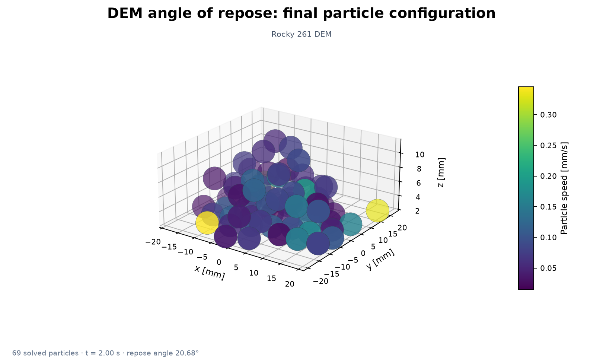

Representative result: [`dem/angle-of-repose`](../benchmarks/dem/cases/smoke_angle_of_repose.py) · [sanitized numeric evidence](assets/simulations/dem/angle-of-repose.evidence.json) · [provenance notes](SIMULATION_RESULTS.md)

| Case and physical problem | Solver / role | Status | Validation basis / representative result | Code, evidence, and visual |
|---|---|---|---|---|
| [`dem/angle-of-repose`](../benchmarks/dem/cases/smoke_angle_of_repose.py) — many-particle pile and angle-of-repose friction trend | Rocky benchmark | **PASS** | Compact historical evidence is linked; no case-specific metric is duplicated here | [code](../benchmarks/dem/cases/smoke_angle_of_repose.py) · [evidence](../benchmarks/dem/references/suite_summary.json) · [solver-result PNG](assets/simulations/dem/angle-of-repose.png) |
| [`dem/cfd-dem-one-way`](../benchmarks/dem/cases/smoke_cfd_dem_one_way.py) — real Fluent F2R field driving Rocky particles (one-way CFD-DEM) | Rocky benchmark | **PASS** | simulation completed; official f2r imported; particle trajectory available | [code](../benchmarks/dem/cases/smoke_cfd_dem_one_way.py) · [evidence](../benchmarks/dem/references/suite_summary.json) |
| [`dem/cfd-dem-two-way`](../benchmarks/dem/cases/smoke_cfd_dem_two_way.py) — exercise and classify the official Fluent/Rocky two-way setup | Rocky benchmark | **BLOCKED** | Compact historical evidence is linked; no case-specific metric is duplicated here | [code](../benchmarks/dem/cases/smoke_cfd_dem_two_way.py) · [evidence](../benchmarks/dem/references/suite_summary.json) |
| [`dem/hopper-discharge`](../benchmarks/dem/cases/smoke_hopper_discharge.py) — real Rocky hopper filling followed by timed sliding-gate discharge | Rocky benchmark | **PASS** | simulation completed; filled before gate open; particles discharged | [code](../benchmarks/dem/cases/smoke_hopper_discharge.py) · [evidence](../benchmarks/dem/references/suite_summary.json) |
| [`dem/nonspherical-particles`](../benchmarks/dem/cases/smoke_nonspherical_particles.py) — sphere versus Rocky-native sphero-cylinder impact/rotation | Rocky benchmark | **PASS** | Compact historical evidence is linked; no case-specific metric is duplicated here | [code](../benchmarks/dem/cases/smoke_nonspherical_particles.py) · [evidence](../benchmarks/dem/references/suite_summary.json) |
| [`dem/particle-collision`](../benchmarks/dem/cases/smoke_particle_collision.py) — one Rocky sphere impacts a rigid triangulated wall | Rocky benchmark | **PASS** | Compact historical evidence is linked; no case-specific metric is duplicated here | [code](../benchmarks/dem/cases/smoke_particle_collision.py) · [evidence](../benchmarks/dem/references/suite_summary.json) |
| [`dem/particle-freefall`](../benchmarks/dem/cases/run_particle_freefall.py) — Launch the particle free-fall case through Rocky's headless script API | Rocky benchmark | **PASS** | Constant-gravity kinematics; maximum position error 1.34 µm | [code](../benchmarks/dem/cases/run_particle_freefall.py) · [evidence](../benchmarks/dem/references/suite_summary.json) · [explanatory schematic](assets/showcase/particle-freefall.svg) |
| [`dem/particle-friction`](../benchmarks/dem/cases/smoke_particle_friction.py) — static/dynamic particle-wall friction on an equivalent incline | Rocky benchmark | **PASS** | Compact historical evidence is linked; no case-specific metric is duplicated here | [code](../benchmarks/dem/cases/smoke_particle_friction.py) · [evidence](../benchmarks/dem/references/suite_summary.json) |
| [`dem/particle-thermal`](../benchmarks/dem/cases/smoke_particle_thermal.py) — hot Rocky particle cooling against a cold isothermal wall | Rocky benchmark | **PASS** | Compact historical evidence is linked; no case-specific metric is duplicated here | [code](../benchmarks/dem/cases/smoke_particle_thermal.py) · [evidence](../benchmarks/dem/references/suite_summary.json) |
| [`dem/validate-rocky-dataset`](../benchmarks/dem/cases/smoke_rocky_dataset.py) — generate ten real Rocky Lagrangian free-fall parameter cases | Python validator/generator dataset | **PASS** | Compact historical evidence is linked; no case-specific metric is duplicated here | [code](../benchmarks/dem/cases/smoke_rocky_dataset.py) · [evidence](../benchmarks/dem/references/suite_summary.json) |
| [`dem/rotating-drum`](../benchmarks/dem/cases/smoke_rotating_drum.py) — two-species mixing in a real Rocky moving-wall tumbler | Rocky benchmark | **PASS** | simulation completed; two species present; adequate inventory | [code](../benchmarks/dem/cases/smoke_rotating_drum.py) · [evidence](../benchmarks/dem/references/suite_summary.json) |
| [`dem/rocky-dataset`](../benchmarks/dem/cases/validate_rocky_dataset.py) — Validate Rocky ragged Lagrangian datasets and optional Eulerian metadata | Python validator/generator utility | **PASS** | Compact historical evidence is linked; no case-specific metric is duplicated here | [code](../benchmarks/dem/cases/validate_rocky_dataset.py) · [evidence](../benchmarks/dem/references/suite_summary.json) |

## Electromagnetics

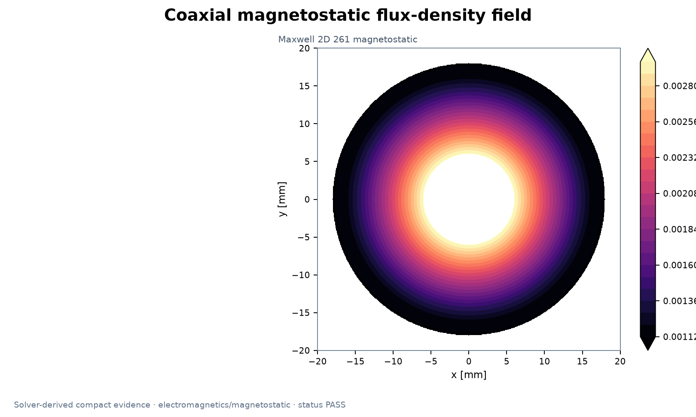

Representative result: [`electromagnetics/magnetostatic`](../benchmarks/electromagnetics/cases/smoke_magnetostatic.py) · [sanitized numeric evidence](assets/simulations/electromagnetics/magnetostatic.evidence.json) · [provenance notes](SIMULATION_RESULTS.md)

| Case and physical problem | Solver / role | Status | Validation basis / representative result | Code, evidence, and visual |
|---|---|---|---|---|
| [`electromagnetics/electrostatic-dataset`](../benchmarks/electromagnetics/cases/generate_electrostatic_dataset.py) — Generate ten genuinely solved Maxwell electrostatic samples and an NPZ dataset | Python validator/generator dataset | **PASS** | ten samples; all solved; all fields same nodes | [code](../benchmarks/electromagnetics/cases/generate_electrostatic_dataset.py) · [evidence](../benchmarks/electromagnetics/references/suite_summary.json) |
| [`electromagnetics/aedt-connect`](../benchmarks/electromagnetics/cases/smoke_aedt_connect.py) — Minimal official PyAEDT Student Maxwell create/save/close smoke test | AEDT benchmark | **PASS** | Compact historical evidence is linked; no case-specific metric is duplicated here | [code](../benchmarks/electromagnetics/cases/smoke_aedt_connect.py) · [evidence](../benchmarks/electromagnetics/references/suite_summary.json) |
| [`electromagnetics/dc-conduction`](../benchmarks/electromagnetics/cases/smoke_dc_conduction.py) — Maxwell 2D uniform DC conductor benchmark | AEDT benchmark | **PASS** | Compact historical evidence is linked; no case-specific metric is duplicated here | [code](../benchmarks/electromagnetics/cases/smoke_dc_conduction.py) · [evidence](../benchmarks/electromagnetics/references/suite_summary.json) |
| [`electromagnetics/eddy-current`](../benchmarks/electromagnetics/cases/smoke_eddy_current.py) — Maxwell 2D AC magnetic skin-effect benchmark | AEDT benchmark | **PASS** | Compact historical evidence is linked; no case-specific metric is duplicated here | [code](../benchmarks/electromagnetics/cases/smoke_eddy_current.py) · [evidence](../benchmarks/electromagnetics/references/suite_summary.json) |
| [`electromagnetics/electrostatic`](../benchmarks/electromagnetics/cases/smoke_electrostatic.py) — Maxwell 2D parallel-plate electrostatic benchmark | AEDT benchmark | **FAIL** | Historical regression remains FAIL; current supported-path diagnosis is separately BLOCKED | [code](../benchmarks/electromagnetics/cases/smoke_electrostatic.py) · [evidence](../benchmarks/electromagnetics/references/release_regression.json) |
| [`electromagnetics/electrothermal-coupling`](../benchmarks/electromagnetics/cases/smoke_electrothermal_coupling.py) — actual Maxwell DC-conduction loss link into an Icepak thermal design | AEDT benchmark | **PASS** | Compact historical evidence is linked; no case-specific metric is duplicated here | [code](../benchmarks/electromagnetics/cases/smoke_electrothermal_coupling.py) · [evidence](../benchmarks/electromagnetics/references/suite_summary.json) |
| [`electromagnetics/force-mechanical-coupling`](../benchmarks/electromagnetics/cases/smoke_force_mechanical_coupling.py) — solve Maxwell force, transfer its numeric value, solve Mechanical deformation | AEDT benchmark | **PASS** | maxwell solved; force parameter created; force is finite nonzero | [code](../benchmarks/electromagnetics/cases/smoke_force_mechanical_coupling.py) · [evidence](../benchmarks/electromagnetics/references/suite_summary.json) |
| [`electromagnetics/hfss-connect`](../benchmarks/electromagnetics/cases/smoke_hfss_connect.py) — Minimal official PyAEDT Student HFSS create/save/close smoke test | AEDT benchmark | **PASS** | Compact historical evidence is linked; no case-specific metric is duplicated here | [code](../benchmarks/electromagnetics/cases/smoke_hfss_connect.py) · [evidence](../benchmarks/electromagnetics/references/suite_summary.json) |
| [`electromagnetics/hfss-waveguide`](../benchmarks/electromagnetics/cases/smoke_hfss_waveguide.py) — HFSS WR-90 rectangular waveguide TE10 benchmark | AEDT benchmark | **PASS** | Compact historical evidence is linked; no case-specific metric is duplicated here | [code](../benchmarks/electromagnetics/cases/smoke_hfss_waveguide.py) · [evidence](../benchmarks/electromagnetics/references/suite_summary.json) |
| [`electromagnetics/magnetostatic`](../benchmarks/electromagnetics/cases/smoke_magnetostatic.py) — Maxwell 2D coaxial current/return magnetostatic benchmark | AEDT benchmark | **PASS** | Compact historical evidence is linked; no case-specific metric is duplicated here | [code](../benchmarks/electromagnetics/cases/smoke_magnetostatic.py) · [evidence](../benchmarks/electromagnetics/references/suite_summary.json) · [solver-result PNG](assets/simulations/electromagnetics/magnetostatic.png) |
| [`electromagnetics/transient-magnetic`](../benchmarks/electromagnetics/cases/smoke_transient_magnetic.py) — Maxwell 2D transient, time-varying current and electromagnetic force | AEDT benchmark | **BLOCKED** | Compact historical evidence is linked; no case-specific metric is duplicated here | [code](../benchmarks/electromagnetics/cases/smoke_transient_magnetic.py) · [evidence](../benchmarks/electromagnetics/references/suite_summary.json) |
| [`electromagnetics/electromagnetics-dataset`](../benchmarks/electromagnetics/cases/validate_electromagnetics_dataset.py) — Independent integrity and physics checks for the electrostatic NPZ dataset | Python validator/generator utility | **PASS** | metadata pass; exactly ten samples; shapes consistent | [code](../benchmarks/electromagnetics/cases/validate_electromagnetics_dataset.py) · [evidence](../benchmarks/electromagnetics/references/suite_summary.json) |

## Material models

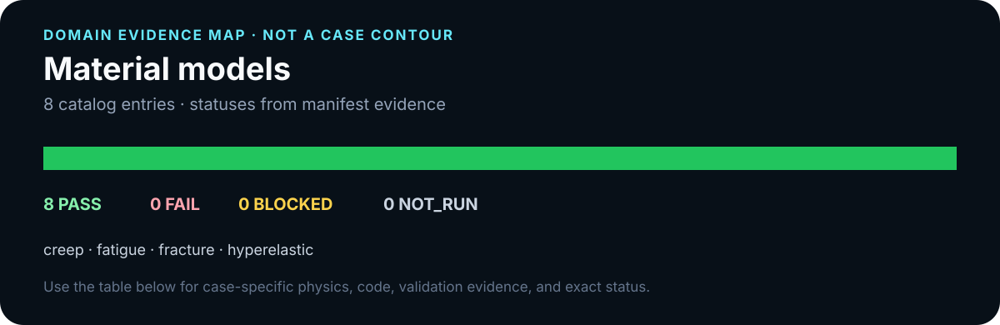

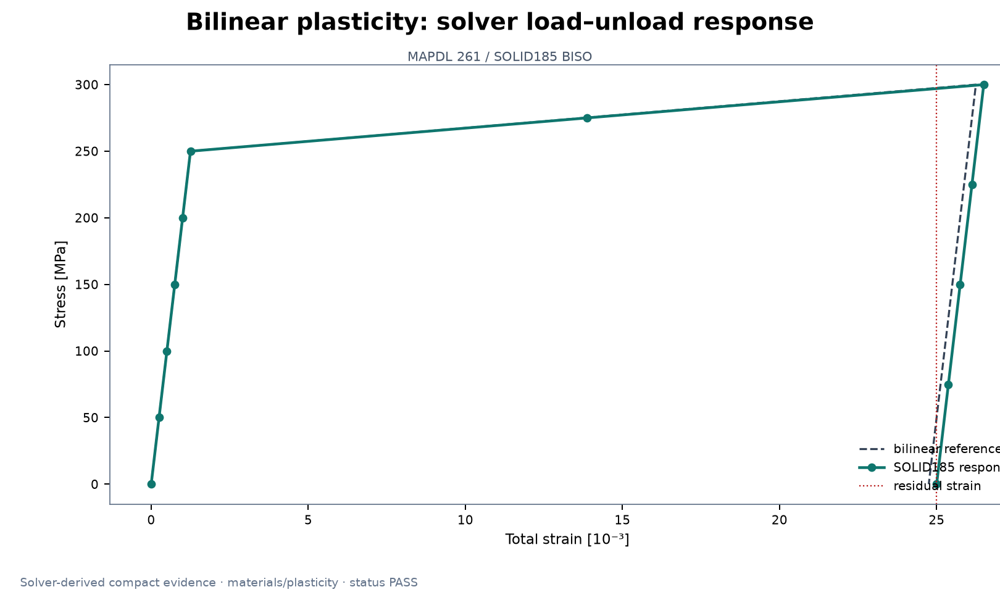

Representative result: [`materials/plasticity`](../benchmarks/materials/cases/smoke_plasticity.py) · [sanitized numeric evidence](assets/simulations/materials/plasticity.evidence.json) · [provenance notes](SIMULATION_RESULTS.md)

| Case and physical problem | Solver / role | Status | Validation basis / representative result | Code, evidence, and visual |
|---|---|---|---|---|
| [`materials/creep`](../benchmarks/materials/cases/smoke_creep.py) — secondary Norton creep under constant axial stress | Mechanical/MAPDL benchmark | **PASS** | history has 40 points; creep grows; positive rate | [code](../benchmarks/materials/cases/smoke_creep.py) · [evidence](../benchmarks/materials/references/historical_results.json) |
| [`materials/fatigue`](../benchmarks/materials/cases/smoke_fatigue.py) — elastic cyclic stress solution plus S-N/Goodman fatigue assessment | Mechanical/MAPDL benchmark | **PASS** | two stress states solved; stress range positive; reaction load conserved | [code](../benchmarks/materials/cases/smoke_fatigue.py) · [evidence](../benchmarks/materials/references/historical_results.json) |
| [`materials/fracture`](../benchmarks/materials/cases/smoke_fracture.py) — mode-I center-crack quarter model with singular tip mesh and CINT SIFS | Mechanical/MAPDL benchmark | **PASS** | five contours; ki positive; contour scatter below 15pct | [code](../benchmarks/materials/cases/smoke_fracture.py) · [evidence](../benchmarks/materials/references/historical_results.json) |
| [`materials/hyperelastic`](../benchmarks/materials/cases/smoke_hyperelastic.py) — large-deformation incompressible Neo-Hookean tension | Mechanical/MAPDL benchmark | **PASS** | stretch at least 1p5; positive force; stress error below 8pct | [code](../benchmarks/materials/cases/smoke_hyperelastic.py) · [evidence](../benchmarks/materials/references/historical_results.json) |
| [`materials/orthotropic`](../benchmarks/materials/cases/smoke_orthotropic.py) — orthotropic lamina effective modulus at 0/45/90 degrees | Mechanical/MAPDL benchmark | **PASS** | three orientations; 0deg error below 3pct; 45deg error below 5pct | [code](../benchmarks/materials/cases/smoke_orthotropic.py) · [evidence](../benchmarks/materials/references/historical_results.json) |
| [`materials/plasticity`](../benchmarks/materials/cases/smoke_plasticity.py) — bilinear isotropic hardening uniaxial load/unload | Mechanical/MAPDL benchmark | **PASS** | yield reached; residual strain positive; reaction stress matches load | [code](../benchmarks/materials/cases/smoke_plasticity.py) · [evidence](../benchmarks/materials/references/historical_results.json) · [solver-result PNG](assets/simulations/materials/plasticity.png) |
| [`materials/single-crystal-elasticity`](../benchmarks/materials/cases/smoke_single_crystal_elasticity.py) — cubic single-crystal directional elastic moduli | Mechanical/MAPDL benchmark | **PASS** | three directions; all errors below 3pct; directional anisotropy observed | [code](../benchmarks/materials/cases/smoke_single_crystal_elasticity.py) · [evidence](../benchmarks/materials/references/historical_results.json) |
| [`materials/viscoelastic`](../benchmarks/materials/cases/smoke_viscoelastic.py) — Prony-series stress relaxation under a held axial strain | Mechanical/MAPDL benchmark | **PASS** | history has 40 points; stress relaxes; long term modulus positive | [code](../benchmarks/materials/cases/smoke_viscoelastic.py) · [evidence](../benchmarks/materials/references/historical_results.json) |

## Mechanics and dynamics

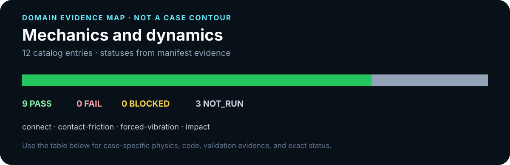

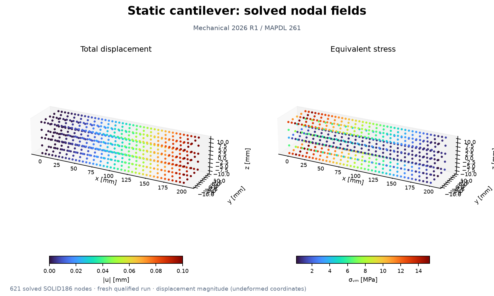

Representative result: [`mechanics/static-cantilever`](../benchmarks/mechanics/cases/smoke_static_cantilever.py) · [sanitized numeric evidence](assets/simulations/mechanics/static-cantilever.evidence.json) · [provenance notes](SIMULATION_RESULTS.md)

| Case and physical problem | Solver / role | Status | Validation basis / representative result | Code, evidence, and visual |
|---|---|---|---|---|
| [`mechanics/connect`](../benchmarks/mechanics/cases/smoke_connect.py) — Connect | Mechanical/MAPDL benchmark | **NOT_RUN** | No attributable run evidence; status remains NOT_RUN | [code](../benchmarks/mechanics/cases/smoke_connect.py) |
| [`mechanics/contact-friction`](../benchmarks/mechanics/cases/smoke_contact_friction.py) — MAPDL nonlinear transient smoke test for Coulomb sliding contact | Mechanical/MAPDL benchmark | **PASS** | history available; contact closed; contact pressure positive | [code](../benchmarks/mechanics/cases/smoke_contact_friction.py) · [evidence](../benchmarks/mechanics/references/historical_results.json) |
| [`mechanics/forced-vibration`](../benchmarks/mechanics/cases/smoke_forced_vibration.py) — MAPDL harmonic-response smoke test for an SDOF oscillator | Mechanical/MAPDL benchmark | **PASS** | two frequencies solved; finite positive amplitudes; frequency response matches theory | [code](../benchmarks/mechanics/cases/smoke_forced_vibration.py) · [evidence](../benchmarks/mechanics/references/historical_results.json) |
| [`mechanics/impact`](../benchmarks/mechanics/cases/smoke_impact.py) — MAPDL nonlinear-transient smoke test for an elastic block impact | Mechanical/MAPDL benchmark | **PASS** | history available; contact occurred; contact pressure positive | [code](../benchmarks/mechanics/cases/smoke_impact.py) · [evidence](../benchmarks/mechanics/references/historical_results.json) |
| [`mechanics/joint-drive`](../benchmarks/mechanics/cases/smoke_joint_drive.py) — PyMechanical prescribed revolute-joint rotation smoke test | Mechanical/MAPDL benchmark | **PASS** | solution done; native revolute joint; prescribed rotation | [code](../benchmarks/mechanics/cases/smoke_joint_drive.py) · [evidence](../benchmarks/mechanics/references/historical_results.json) |
| [`mechanics/modal-cantilever`](../benchmarks/mechanics/cases/smoke_modal_cantilever.py) — Minimal elastic 3D cantilever modal analysis driven through PyMechanical | Mechanical/MAPDL benchmark | **PASS** | mechanical version is 261; model import succeeded; solution status done | [code](../benchmarks/mechanics/cases/smoke_modal_cantilever.py) · [evidence](../benchmarks/mechanics/references/historical_results.json) |
| [`mechanics/multibody-flexible`](../benchmarks/mechanics/cases/smoke_multibody_flexible.py) — PyMechanical rigid-flexible double-link transient smoke test for Mechanical 261 | Mechanical/MAPDL benchmark | **PASS** | solution done; rigid and flexible bodies; two revolute joints | [code](../benchmarks/mechanics/cases/smoke_multibody_flexible.py) · [evidence](../benchmarks/mechanics/references/historical_results.json) |
| [`mechanics/multibody-rigid`](../benchmarks/mechanics/cases/smoke_multibody_rigid.py) — PyMechanical rigid-dynamics double-pendulum smoke test for Mechanical 261 | Mechanical/MAPDL benchmark | **PASS** | solution done; two bodies; two revolute joints | [code](../benchmarks/mechanics/cases/smoke_multibody_rigid.py) · [evidence](../benchmarks/mechanics/references/historical_results.json) |
| [`mechanics/spring-damper`](../benchmarks/mechanics/cases/smoke_spring_damper.py) — MAPDL transient smoke test for a one-DOF mass-spring-damper system | Mechanical/MAPDL benchmark | **PASS** | solver history; finite response; decaying response | [code](../benchmarks/mechanics/cases/smoke_spring_damper.py) · [evidence](../benchmarks/mechanics/references/historical_results.json) |
| [`mechanics/static-cantilever`](../benchmarks/mechanics/cases/smoke_static_cantilever.py) — Minimal 3D cantilever solve driven through PyMechanical | Mechanical/MAPDL benchmark | **PASS** | Euler–Bernoulli tip deflection; 0.100143 mm vs 0.100000 mm (0.143% error) | [code](../benchmarks/mechanics/cases/smoke_static_cantilever.py) · [evidence](../benchmarks/mechanics/references/historical_results.json) · [solver-result PNG](assets/simulations/mechanics/static-cantilever.png) |
| [`mechanics/spaceclaim-multibody-geometry`](../benchmarks/mechanics/cases/spaceclaim_multibody_geometry.py) — Spaceclaim Multibody Geometry | SpaceClaim benchmark | **NOT_RUN** | No attributable run evidence; status remains NOT_RUN | [code](../benchmarks/mechanics/cases/spaceclaim_multibody_geometry.py) |
| [`mechanics/spaceclaim-single-link-geometry`](../benchmarks/mechanics/cases/spaceclaim_single_link_geometry.py) — SpaceClaim 261 headless script: create one independent rectangular link | SpaceClaim benchmark | **NOT_RUN** | No attributable run evidence; status remains NOT_RUN | [code](../benchmarks/mechanics/cases/spaceclaim_single_link_geometry.py) |

## Multiphysics coupling

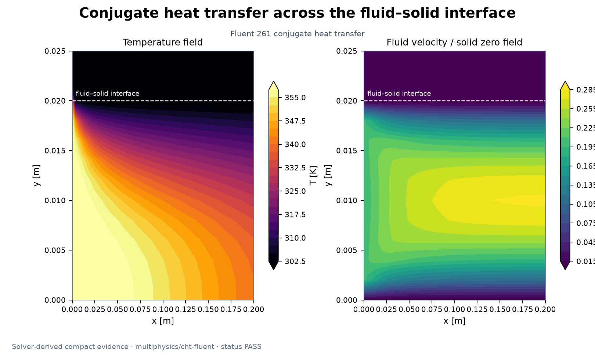

Representative result: [`multiphysics/cht-fluent`](../benchmarks/multiphysics/cases/smoke_cht_fluent.py) · [sanitized numeric evidence](assets/simulations/multiphysics/cht-fluent.evidence.json) · [provenance notes](SIMULATION_RESULTS.md)

| Case and physical problem | Solver / role | Status | Validation basis / representative result | Code, evidence, and visual |
|---|---|---|---|---|
| [`multiphysics/cht-fluent`](../benchmarks/multiphysics/cases/smoke_cht_fluent.py) — Fluent-native conjugate heat transfer in a two-zone channel | Fluent/Mechanical benchmark | **PASS** | Global energy closure and temperature bounds; historical imbalance 0.900% | [code](../benchmarks/multiphysics/cases/smoke_cht_fluent.py) · [evidence](../benchmarks/multiphysics/references/historical_results.json) · [solver-result PNG](assets/simulations/multiphysics/cht-fluent.png) |
| [`multiphysics/cht-system-coupling`](../benchmarks/multiphysics/cases/smoke_cht_system_coupling.py) — Fluent-MAPDL partitioned conjugate heat transfer via System Coupling | Fluent/Mechanical/System Coupling benchmark | **PASS** | two participants registered; interface created; two data transfers | [code](../benchmarks/multiphysics/cases/smoke_cht_system_coupling.py) · [evidence](../benchmarks/multiphysics/references/historical_results.json) |
| [`multiphysics/fsi-one-way`](../benchmarks/multiphysics/cases/smoke_fsi_one_way.py) — conservative one-way Fluent surface-force to MAPDL structure transfer | Fluent/Mechanical/System Coupling benchmark | **PASS** | fluent source pass; pressure and viscous force present; all structure nodes mapped | [code](../benchmarks/multiphysics/cases/smoke_fsi_one_way.py) · [evidence](../benchmarks/multiphysics/references/historical_results.json) |
| [`multiphysics/fsi-turek-hron`](../benchmarks/multiphysics/cases/smoke_fsi_turek_hron.py) — official Turek-Hron FSI2 startup smoke (formal benchmark needs 35 s) | Fluent/Mechanical/System Coupling benchmark | **FAIL** | Formal comparison window was not reached; historical status remains FAIL | [code](../benchmarks/multiphysics/cases/smoke_fsi_turek_hron.py) · [evidence](../benchmarks/multiphysics/references/historical_results.json) |
| [`multiphysics/fsi-two-way`](../benchmarks/multiphysics/cases/smoke_fsi_two_way.py) — shortened official oscillating-plate two-way transient FSI | Fluent/Mechanical/System Coupling benchmark | **PASS** | ten time steps; mapping 100 percent; coupling iterations recorded | [code](../benchmarks/multiphysics/cases/smoke_fsi_two_way.py) · [evidence](../benchmarks/multiphysics/references/historical_results.json) |
| [`multiphysics/validate-multiphysics-dataset`](../benchmarks/multiphysics/cases/smoke_multiphysics_dataset.py) — eight real Fluid -> Thermal -> Structural dataset cases | Python validator/generator dataset | **PASS** | eight actual case F sequences; all exports valid; dataset validator pass | [code](../benchmarks/multiphysics/cases/smoke_multiphysics_dataset.py) · [evidence](../benchmarks/multiphysics/references/historical_results.json) |
| [`multiphysics/system-coupling-connect`](../benchmarks/multiphysics/cases/smoke_system_coupling_connect.py) — verify the local PySystemCoupling-to-System Coupling 261 link | Fluent/Mechanical/System Coupling benchmark | **PASS** | launcher found; import available; ping | [code](../benchmarks/multiphysics/cases/smoke_system_coupling_connect.py) · [evidence](../benchmarks/multiphysics/references/historical_results.json) |
| [`multiphysics/thermal-fluid-structural`](../benchmarks/multiphysics/cases/smoke_thermal_fluid_structural.py) — sequential Fluent CHT temperature field to MAPDL structural response | Fluent/Mechanical benchmark | **PASS** | source case actual; temperature gradient nonzero; all nodes mapped | [code](../benchmarks/multiphysics/cases/smoke_thermal_fluid_structural.py) · [evidence](../benchmarks/multiphysics/references/historical_results.json) |
| [`multiphysics/thermo-fsi`](../benchmarks/multiphysics/cases/smoke_thermo_fsi.py) — synchronous four-variable thermal-fluid-structural coupling | Fluent/Mechanical/System Coupling benchmark | **PASS** | four transfers created; all interface nodes mapped; mapped area at least 99pct | [code](../benchmarks/multiphysics/cases/smoke_thermo_fsi.py) · [evidence](../benchmarks/multiphysics/references/historical_results.json) |
| [`multiphysics/multiphysics-dataset`](../benchmarks/multiphysics/cases/validate_multiphysics_dataset.py) — Validate independently meshed Fluid -> Thermal -> Structural NPZ cases | Python validator/generator utility | **PASS** | case count 8 to 15; all cases valid; parameter schema consistent | [code](../benchmarks/multiphysics/cases/validate_multiphysics_dataset.py) · [evidence](../benchmarks/multiphysics/references/historical_results.json) |

## Phase change and reactive flow

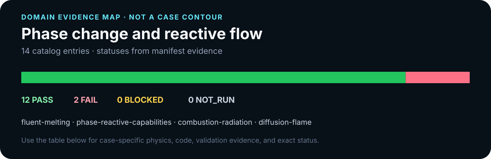

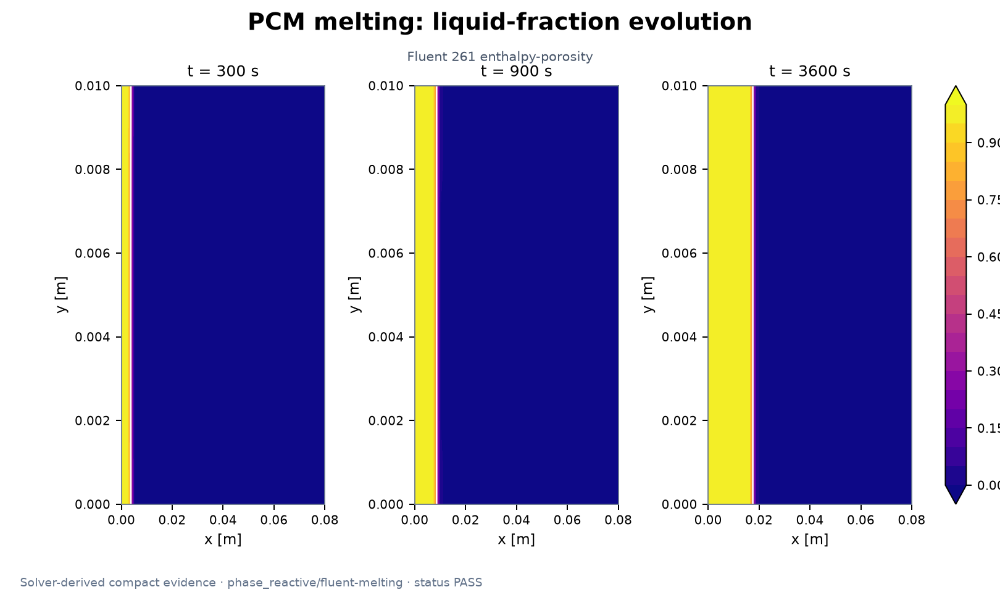

Representative result: [`phase_reactive/fluent-melting`](../benchmarks/phase_reactive/cases/smoke_fluent_melting.py) · [sanitized numeric evidence](assets/simulations/phase_reactive/fluent-melting.evidence.json) · [provenance notes](SIMULATION_RESULTS.md)

| Case and physical problem | Solver / role | Status | Validation basis / representative result | Code, evidence, and visual |
|---|---|---|---|---|
| [`phase_reactive/fluent-melting`](../benchmarks/phase_reactive/cases/smoke_fluent_melting.py) — transient Fluent enthalpy-porosity melting in a 2-D PCM slab | Fluent benchmark | **PASS** | native model enabled; multiple snapshots; liquid fraction bounded | [code](../benchmarks/phase_reactive/cases/smoke_fluent_melting.py) · [evidence](../benchmarks/phase_reactive/references/suite_summary.json) · [solver-result PNG](assets/simulations/phase_reactive/fluent-melting.png) |
| [`phase_reactive/phase-reactive-capabilities`](../benchmarks/phase_reactive/cases/probe_phase_reactive_capabilities.py) — executable capability inventory for phase change and reacting flow | Fluent/MAPDL utility | **PASS** | mapdl enthalpy probe; fluent native melting; fluent species and reactions | [code](../benchmarks/phase_reactive/cases/probe_phase_reactive_capabilities.py) · [evidence](../benchmarks/phase_reactive/references/suite_summary.json) |
| [`phase_reactive/combustion-radiation`](../benchmarks/phase_reactive/cases/smoke_combustion_radiation.py) — controlled no-radiation/P-1 comparison from the same reacting field | Fluent benchmark | **PASS** | same reacting initial state; p1 model enabled; radiation field nonzero | [code](../benchmarks/phase_reactive/cases/smoke_combustion_radiation.py) · [evidence](../benchmarks/phase_reactive/references/suite_summary.json) |
| [`phase_reactive/diffusion-flame`](../benchmarks/phase_reactive/cases/smoke_diffusion_flame.py) — Fluent-native non-premixed methane/air mixing and finite-rate reaction | Fluent benchmark | **PASS** | native species transport; native finite rate reaction; fuel and oxidizer mix at reaction peak | [code](../benchmarks/phase_reactive/cases/smoke_diffusion_flame.py) · [evidence](../benchmarks/phase_reactive/references/suite_summary.json) |
| [`phase_reactive/finite-rate-reactor`](../benchmarks/phase_reactive/cases/smoke_finite_rate_reactor.py) — native Fluent finite-rate methane-air reacting channel | Fluent benchmark | **PASS** | native finite rate model; reaction rate field available; temperature rises gt 10K | [code](../benchmarks/phase_reactive/cases/smoke_finite_rate_reactor.py) · [evidence](../benchmarks/phase_reactive/references/suite_summary.json) |
| [`phase_reactive/moving-heat-source`](../benchmarks/phase_reactive/cases/smoke_moving_heat_source.py) — regularized moving-source melt-pool trend benchmark | Reduced-order Python benchmark | **PASS** | liquid fraction bounded; higher power larger pool; higher speed smaller pool | [code](../benchmarks/phase_reactive/cases/smoke_moving_heat_source.py) · [evidence](../benchmarks/phase_reactive/references/suite_summary.json) |
| [`phase_reactive/natural-convection-melting`](../benchmarks/phase_reactive/cases/smoke_natural_convection_melting.py) — Fluent buoyancy-coupled melting versus zero-gravity reference | Fluent benchmark | **PASS** | both native runs completed; fraction bounded; buoyant flow nonzero | [code](../benchmarks/phase_reactive/cases/smoke_natural_convection_melting.py) · [evidence](../benchmarks/phase_reactive/references/suite_summary.json) |
| [`phase_reactive/phase-change-dataset`](../benchmarks/phase_reactive/cases/smoke_phase_change_dataset.py) — 12-case Stefan phase-change field dataset | Python validator/generator dataset | **PASS** | case count 12; field shape; bounded | [code](../benchmarks/phase_reactive/cases/smoke_phase_change_dataset.py) · [evidence](../benchmarks/phase_reactive/references/suite_summary.json) |
| [`phase_reactive/premixed-combustion`](../benchmarks/phase_reactive/cases/smoke_premixed_combustion.py) — Fluent-native premixed methane/air autoignition in an adiabatic channel | Fluent benchmark | **FAIL** | Required combustion checks failed; targeted diagnostic evidence is preserved | [code](../benchmarks/phase_reactive/cases/smoke_premixed_combustion.py) · [evidence](../benchmarks/phase_reactive/references/targeted_diagnostics.json) |
| [`phase_reactive/reaction-diffusion`](../benchmarks/phase_reactive/cases/smoke_reaction_diffusion.py) — first-order A -> B plug-flow reaction benchmark | Reduced-order Python benchmark | **PASS** | max abs analytical error lt 0p005; species bounded; species sum error lt 1e-12 | [code](../benchmarks/phase_reactive/cases/smoke_reaction_diffusion.py) · [evidence](../benchmarks/phase_reactive/references/suite_summary.json) |
| [`phase_reactive/reactive-cht`](../benchmarks/phase_reactive/cases/smoke_reactive_cht.py) — Fluent-native finite-rate reacting flow with a conjugate solid wall | Fluent benchmark | **FAIL** | 10-step energy error 15.842% exceeds the unchanged 10% limit | [code](../benchmarks/phase_reactive/cases/smoke_reactive_cht.py) · [evidence](../benchmarks/phase_reactive/references/targeted_diagnostics.json) |
| [`phase_reactive/reactive-dataset`](../benchmarks/phase_reactive/cases/smoke_reactive_dataset.py) — 12-case lumped methane-reaction transport field dataset | Python validator/generator dataset | **PASS** | case count 12; field shape; species bounded | [code](../benchmarks/phase_reactive/cases/smoke_reactive_dataset.py) · [evidence](../benchmarks/phase_reactive/references/suite_summary.json) |
| [`phase_reactive/stefan-phase-change`](../benchmarks/phase_reactive/cases/smoke_stefan_phase_change.py) — one-phase Stefan latent-heat benchmark with energy accounting | Reduced-order Python benchmark | **PASS** | stefan root residual lt 1e-10; interface monotonic; interface sqrt time | [code](../benchmarks/phase_reactive/cases/smoke_stefan_phase_change.py) · [evidence](../benchmarks/phase_reactive/references/suite_summary.json) |
| [`phase_reactive/phase-reactive-dataset`](../benchmarks/phase_reactive/cases/validate_phase_reactive_dataset.py) — Independent full-reload validation for phase/reactive NPZ datasets | Python validator/generator utility | **PASS** | finite; fraction bounded; time ordering | [code](../benchmarks/phase_reactive/cases/validate_phase_reactive_dataset.py) · [evidence](../benchmarks/phase_reactive/references/suite_summary.json) |

## Porous media and geomechanics

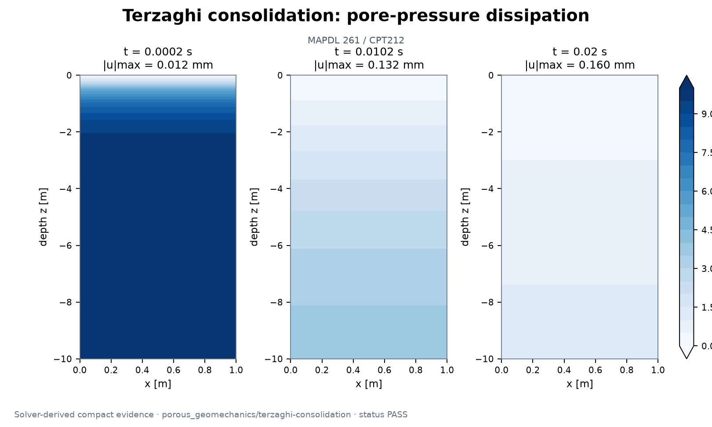

Representative result: [`porous_geomechanics/terzaghi-consolidation`](../benchmarks/porous_geomechanics/cases/smoke_terzaghi_consolidation.py) · [sanitized numeric evidence](assets/simulations/porous_geomechanics/terzaghi-consolidation.evidence.json) · [provenance notes](SIMULATION_RESULTS.md)

| Case and physical problem | Solver / role | Status | Validation basis / representative result | Code, evidence, and visual |
|---|---|---|---|---|
| [`porous_geomechanics/porous-geomechanics-capabilities`](../benchmarks/porous_geomechanics/cases/probe_porous_geomechanics_capabilities.py) — exercise the Ansys 261 porous-media and soil-analysis APIs | Fluent/MAPDL utility | **PASS** | fluent porous settings roundtrip; mapdl coupled pore element available; mapdl batch completed | [code](../benchmarks/porous_geomechanics/cases/probe_porous_geomechanics_capabilities.py) · [evidence](../benchmarks/porous_geomechanics/references/suite_summary.json) |
| [`porous_geomechanics/anisotropic-porous`](../benchmarks/porous_geomechanics/cases/smoke_anisotropic_porous.py) — Fluent directional permeability identification and tensor check | Fluent benchmark | **PASS** | isotropic reference solved; anisotropic x permeability error lt 3pct; orthogonal resistance roundtrip | [code](../benchmarks/porous_geomechanics/cases/smoke_anisotropic_porous.py) · [evidence](../benchmarks/porous_geomechanics/references/suite_summary.json) |
| [`porous_geomechanics/darcy-flow`](../benchmarks/porous_geomechanics/cases/smoke_darcy_flow.py) — Fluent one-dimensional Darcy-flow benchmark | Fluent benchmark | **PASS** | pressure gradient error lt 3pct; flow rate positive; permeability error lt 3pct | [code](../benchmarks/porous_geomechanics/cases/smoke_darcy_flow.py) · [evidence](../benchmarks/porous_geomechanics/references/suite_summary.json) |
| [`porous_geomechanics/forchheimer-flow`](../benchmarks/porous_geomechanics/cases/smoke_forchheimer_flow.py) — Fluent Darcy-Forchheimer velocity sweep and coefficient fit | Fluent benchmark | **PASS** | seven conditions; linear coefficient error lt 5pct; quadratic coefficient error lt 5pct | [code](../benchmarks/porous_geomechanics/cases/smoke_forchheimer_flow.py) · [evidence](../benchmarks/porous_geomechanics/references/suite_summary.json) |
| [`porous_geomechanics/geomechanics-material`](../benchmarks/porous_geomechanics/cases/smoke_geomechanics_material.py) — plane-strain compression with native Mohr-Coulomb plasticity | MAPDL benchmark | **PASS** | confining pressure positive; yield reached; yield error lt 18pct | [code](../benchmarks/porous_geomechanics/cases/smoke_geomechanics_material.py) · [evidence](../benchmarks/porous_geomechanics/references/suite_summary.json) |
| [`porous_geomechanics/geostatic-consolidation`](../benchmarks/porous_geomechanics/cases/smoke_geostatic_consolidation.py) — gravity/geostatic stage followed by excess-pore-pressure consolidation | MAPDL benchmark | **PASS** | hydrostatic profile error lt 8pct; initial stress increases with depth; geostatic stress scale reasonable | [code](../benchmarks/porous_geomechanics/cases/smoke_geostatic_consolidation.py) · [evidence](../benchmarks/porous_geomechanics/references/suite_summary.json) |
| [`porous_geomechanics/validate-porous-dataset`](../benchmarks/porous_geomechanics/cases/smoke_porous_dataset.py) — generate ten native MAPDL poromechanics cases for ROM/Neural Operators | Python validator/generator dataset | **PASS** | Compact historical evidence is linked; no case-specific metric is duplicated here | [code](../benchmarks/porous_geomechanics/cases/smoke_porous_dataset.py) · [evidence](../benchmarks/porous_geomechanics/references/suite_summary.json) |
| [`porous_geomechanics/porous-heat-transfer`](../benchmarks/porous_geomechanics/cases/smoke_porous_heat_transfer.py) — heated Fluent porous channel with a global energy balance | Fluent benchmark | **PASS** | temperature rises; heat input positive; energy balance lt 8pct | [code](../benchmarks/porous_geomechanics/cases/smoke_porous_heat_transfer.py) · [evidence](../benchmarks/porous_geomechanics/references/suite_summary.json) |
| [`porous_geomechanics/porous-species`](../benchmarks/porous_geomechanics/cases/smoke_porous_species.py) — transient tracer breakthrough through a Fluent porous column | Fluent benchmark | **PASS** | species bounded; species sum error lt 1e 4; breakthrough monotonic | [code](../benchmarks/porous_geomechanics/cases/smoke_porous_species.py) · [evidence](../benchmarks/porous_geomechanics/references/suite_summary.json) |
| [`porous_geomechanics/terzaghi-consolidation`](../benchmarks/porous_geomechanics/cases/smoke_terzaghi_consolidation.py) — native CPT212 one-dimensional Terzaghi consolidation benchmark | MAPDL benchmark | **PASS** | native pore pressure positive; pore pressure dissipates; profile l2 max lt 12pct | [code](../benchmarks/porous_geomechanics/cases/smoke_terzaghi_consolidation.py) · [evidence](../benchmarks/porous_geomechanics/references/suite_summary.json) · [solver-result PNG](assets/simulations/porous_geomechanics/terzaghi-consolidation.png) |
| [`porous_geomechanics/thermo-poroelastic`](../benchmarks/porous_geomechanics/cases/smoke_thermo_poroelastic.py) — CPT212 structural-pore-pressure-thermal three-field benchmark | MAPDL benchmark | **PASS** | temperature field solved; pore pressure field responds; displacement field responds | [code](../benchmarks/porous_geomechanics/cases/smoke_thermo_poroelastic.py) · [evidence](../benchmarks/porous_geomechanics/references/suite_summary.json) |
| [`porous_geomechanics/porous-dataset`](../benchmarks/porous_geomechanics/cases/validate_porous_dataset.py) — Validate canonical porous/geomechanics NPZ datasets and basic physics | Python validator/generator utility | **PASS** | Compact historical evidence is linked; no case-specific metric is duplicated here | [code](../benchmarks/porous_geomechanics/cases/validate_porous_dataset.py) · [evidence](../benchmarks/porous_geomechanics/references/historical_results.json) |

## SPH free-surface flow

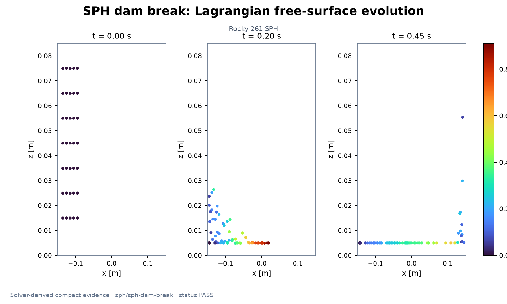

Representative result: [`sph/sph-dam-break`](../benchmarks/sph/cases/smoke_sph_dam_break.py) · [sanitized numeric evidence](assets/simulations/sph/sph-dam-break.evidence.json) · [provenance notes](SIMULATION_RESULTS.md)

| Case and physical problem | Solver / role | Status | Validation basis / representative result | Code, evidence, and visual |
|---|---|---|---|---|
| [`sph/prepare-sph-dataset`](../benchmarks/sph/cases/prepare_sph_dataset.py) — Remove only solver-undefined snapshots from Case L and record the exclusion | Python validator/generator utility | **PASS** | Compact historical evidence is linked; no case-specific metric is duplicated here | [code](../benchmarks/sph/cases/prepare_sph_dataset.py) · [evidence](../benchmarks/sph/references/suite_summary.json) |
| [`sph/sph-capabilities`](../benchmarks/sph/cases/probe_sph_capabilities.py) — Phase-0 runtime inventory for SPH modules, beta features, and couplings | Rocky utility | **PASS** | Compact historical evidence is linked; no case-specific metric is duplicated here | [code](../benchmarks/sph/cases/probe_sph_capabilities.py) · [evidence](../benchmarks/sph/references/suite_summary.json) |
| [`sph/sph-dam-break`](../benchmarks/sph/cases/smoke_sph_dam_break.py) — narrow-3D native SPH dam-break benchmark | Rocky benchmark | **PASS** | Front advance, mass conservation, finite history, and projection checks | [code](../benchmarks/sph/cases/smoke_sph_dam_break.py) · [evidence](../benchmarks/sph/references/suite_summary.json) · [solver-result PNG](assets/simulations/sph/sph-dam-break.png) |
| [`sph/validate-sph-dataset`](../benchmarks/sph/cases/smoke_sph_dataset.py) — ten real native-SPH dam-break parameter cases | Python validator/generator dataset | **PASS** | ten cases; all solvers advanced; raw tables nonempty | [code](../benchmarks/sph/cases/smoke_sph_dataset.py) · [evidence](../benchmarks/sph/references/suite_summary.json) |
| [`sph/sph-flexible-structure`](../benchmarks/sph/cases/smoke_sph_flexible_structure.py) — Case I evidence-based blocker for automated two-way SPH-structure coupling | Rocky benchmark | **BLOCKED** | Compact historical evidence is linked; no case-specific metric is duplicated here | [code](../benchmarks/sph/cases/smoke_sph_flexible_structure.py) · [evidence](../benchmarks/sph/references/suite_summary.json) |
| [`sph/sph-hydrostatic`](../benchmarks/sph/cases/smoke_sph_hydrostatic.py) — native SPH hydrostatic pressure benchmark in an open tank | Rocky benchmark | **PASS** | solver advanced; at least 20 elements; mass conservation lt 1pct | [code](../benchmarks/sph/cases/smoke_sph_hydrostatic.py) · [evidence](../benchmarks/sph/references/suite_summary.json) |
| [`sph/sph-jet-impact`](../benchmarks/sph/cases/smoke_sph_jet_impact.py) — native SPH free jet impacting a fixed rigid plate | Rocky benchmark | **PASS** | solver advanced; jet elements generated; impact pressure positive | [code](../benchmarks/sph/cases/smoke_sph_jet_impact.py) · [evidence](../benchmarks/sph/references/suite_summary.json) |
| [`sph/sph-moving-boundary`](../benchmarks/sph/cases/smoke_sph_moving_boundary.py) — translating piston transfers momentum into a native SPH free surface | Rocky benchmark | **PASS** | solver advanced; horizontal kinetic energy increases; fluid velocity nonzero | [code](../benchmarks/sph/cases/smoke_sph_moving_boundary.py) · [evidence](../benchmarks/sph/references/suite_summary.json) |
| [`sph/sph-non-newtonian`](../benchmarks/sph/cases/smoke_sph_non_newtonian.py) — Case F capability verdict; never substitutes a Newtonian or custom solver | Rocky benchmark | **BLOCKED** | Compact historical evidence is linked; no case-specific metric is duplicated here | [code](../benchmarks/sph/cases/smoke_sph_non_newtonian.py) · [evidence](../benchmarks/sph/references/suite_summary.json) |
| [`sph/sph-resolution`](../benchmarks/sph/cases/smoke_sph_resolution.py) — native SPH coarse/medium/fine dam-break sensitivity | Rocky benchmark | **PASS** | all solvers advanced; element count increases; mass conservation lt 1pct | [code](../benchmarks/sph/cases/smoke_sph_resolution.py) · [evidence](../benchmarks/sph/references/suite_summary.json) |
| [`sph/sph-rigid-body`](../benchmarks/sph/cases/smoke_sph_rigid_body.py) — free rigid plate falls into a native SPH free surface | Rocky benchmark | **PASS** | solver advanced; fluid fields; rigid body state api | [code](../benchmarks/sph/cases/smoke_sph_rigid_body.py) · [evidence](../benchmarks/sph/references/suite_summary.json) |
| [`sph/sph-sloshing`](../benchmarks/sph/cases/smoke_sph_sloshing.py) — off-resonance and near-resonance native SPH tank sloshing | Rocky benchmark | **PASS** | both solvers advanced; finite amplitudes; near resonance response larger | [code](../benchmarks/sph/cases/smoke_sph_sloshing.py) · [evidence](../benchmarks/sph/references/suite_summary.json) |
| [`sph/sph-thermal`](../benchmarks/sph/cases/smoke_sph_thermal.py) — hot native SPH liquid cooling against a prescribed cold wall | Rocky benchmark | **PASS** | solver advanced; temperature field exported; liquid cools | [code](../benchmarks/sph/cases/smoke_sph_thermal.py) · [evidence](../benchmarks/sph/references/suite_summary.json) |
| [`sph/sph-vof-comparison`](../benchmarks/sph/cases/smoke_sph_vof_comparison.py) — dimensionless cross-check of geometrically similar SPH and Fluent VOF dam breaks | Rocky benchmark | **PASS** | sph pass; vof pass; five comparison points | [code](../benchmarks/sph/cases/smoke_sph_vof_comparison.py) · [evidence](../benchmarks/sph/references/suite_summary.json) |
| [`sph/sph-dataset`](../benchmarks/sph/cases/validate_sph_dataset.py) — Validate Case L raw Lagrangian tables and derived Eulerian projections | Python validator/generator utility | **PASS** | Compact historical evidence is linked; no case-specific metric is duplicated here | [code](../benchmarks/sph/cases/validate_sph_dataset.py) · [evidence](../benchmarks/sph/references/suite_summary.json) |

## Thermal analysis

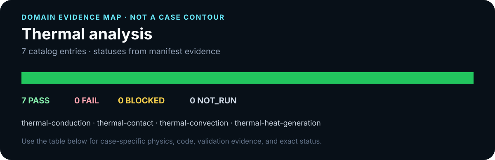

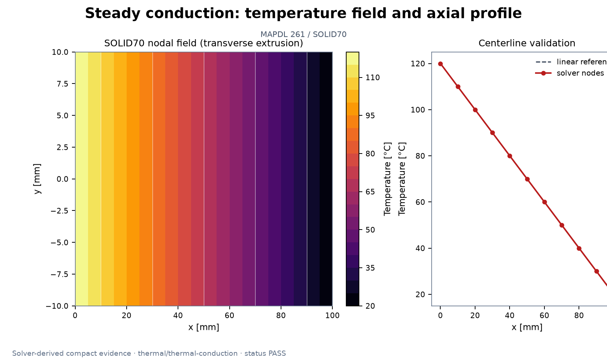

Representative result: [`thermal/thermal-conduction`](../benchmarks/thermal/cases/smoke_thermal_conduction.py) · [sanitized numeric evidence](assets/simulations/thermal/thermal-conduction.evidence.json) · [provenance notes](SIMULATION_RESULTS.md)

| Case and physical problem | Solver / role | Status | Validation basis / representative result | Code, evidence, and visual |
|---|---|---|---|---|
| [`thermal/thermal-conduction`](../benchmarks/thermal/cases/smoke_thermal_conduction.py) — steady one-dimensional conduction through a rectangular solid | Mechanical/MAPDL benchmark | **PASS** | solver output exists; temperature is linear; heat flow error below 1pct | [code](../benchmarks/thermal/cases/smoke_thermal_conduction.py) · [evidence](../benchmarks/thermal/references/historical_results.json) · [solver-result PNG](assets/simulations/thermal/thermal-conduction.png) |
| [`thermal/thermal-contact`](../benchmarks/thermal/cases/smoke_thermal_contact.py) — two solids joined by finite-conductance CONTA174/TARGE170 thermal contact | Mechanical/MAPDL benchmark | **PASS** | contact elements created; finite heat flow error below 2pct; contact jump error below 2pct | [code](../benchmarks/thermal/cases/smoke_thermal_contact.py) · [evidence](../benchmarks/thermal/references/historical_results.json) |
| [`thermal/thermal-convection`](../benchmarks/thermal/cases/smoke_thermal_convection.py) — conduction through a wall terminated by a convection boundary | Mechanical/MAPDL benchmark | **PASS** | heat flow error below 1pct; surface temperature error below 0 1c; convection energy balance below 1pct | [code](../benchmarks/thermal/cases/smoke_thermal_convection.py) · [evidence](../benchmarks/thermal/references/historical_results.json) |
| [`thermal/thermal-heat-generation`](../benchmarks/thermal/cases/smoke_thermal_heat_generation.py) — steady slab with uniform volumetric heat generation | Mechanical/MAPDL benchmark | **PASS** | center is hottest; center temperature error below 2pct; energy balance below 1pct | [code](../benchmarks/thermal/cases/smoke_thermal_heat_generation.py) · [evidence](../benchmarks/thermal/references/historical_results.json) |
| [`thermal/thermal-radiation`](../benchmarks/thermal/cases/smoke_thermal_radiation.py) — nonlinear radiation plus convection from a hot surface | Mechanical/MAPDL benchmark | **PASS** | surface temperature error below 0 2c; energy balance below 1pct; radiation is nonzero | [code](../benchmarks/thermal/cases/smoke_thermal_radiation.py) · [evidence](../benchmarks/thermal/references/historical_results.json) |
| [`thermal/thermal-structural`](../benchmarks/thermal/cases/smoke_thermal_structural.py) — sequential thermal-to-structural free-expansion benchmark | Mechanical/MAPDL benchmark | **PASS** | thermal field is uniform; ldread mapped all nodes; thermal solution matches applied temperature | [code](../benchmarks/thermal/cases/smoke_thermal_structural.py) · [evidence](../benchmarks/thermal/references/historical_results.json) |
| [`thermal/thermal-transient`](../benchmarks/thermal/cases/smoke_thermal_transient.py) — transient cooling of a small high-conductivity cube | Mechanical/MAPDL benchmark | **PASS** | biot below 0 1; history has 241 points; temperature monotonic | [code](../benchmarks/thermal/cases/smoke_thermal_transient.py) · [evidence](../benchmarks/thermal/references/historical_results.json) |

---

Update with `python tools/build_gallery.py`; verify freshness with `python tools/build_gallery.py --check`. Manifests and compact reference evidence remain the status sources of truth.
